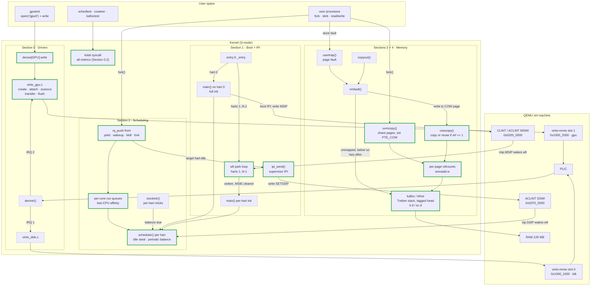

# xv6-riscv Extensions: Design Document

## Purpose and scope

This document designs five extensions to the xv6-riscv kernel in
`xv6/xv6/kernel/`. For each feature it covers:

- **Background:** the hardware or OS concepts the design depends on.
- **Current behavior:** what the kernel does today, with file:line references
  checked against this checkout.
- **Design decisions:** each choice, the alternatives, and the reasoning.
- **Low-level design:** the code changes.
- **Correctness argument:** invariants, lock ordering, memory ordering.
- **Pitfalls:** plausible implementations that would crash, hang, leak or
  corrupt the kernel, and why.
- **Testing and metrics:** how to show the feature works, and the numbers to
  report.

### Baseline facts this design relies on

| Fact | Where |
|---|---|
| QEMU runs `-machine virt -bios none -smp $(CPUS)`, default 3 harts, 128 MB RAM, `-nographic` | Makefile:173-177 |
| No firmware: every hart starts in M-mode at QEMU's 40-byte reset ROM (`0x1000`), which sets `a0 = mhartid`, `a1 =` device-tree address (`0x87e00000`), and jumps to `0x80000000`. `entry.S` immediately overwrites `a0`/`a1`. `start()` delegates all traps to S-mode and never sets `mtvec` | QEMU `info roms`, `xp /6i 0x1000`; entry.S; start.c:14-52 |
| `NCPU = 8`, `NPROC = 64`, `NDEV = 10`, `USERSTACK = 1` page | param.h |
| Kernel page table maps only UART, VIRTIO0, PLIC, kernel image and RAM 1:1, trampoline, and kernel stacks | vm.c:22-52 |
| Kernel stacks live at high virtual addresses (`KSTACK(p)`), **not** identity-mapped | memlayout.h:52, proc.c:33-45 |
| Scheduler scans all 64 `proc[]` slots per pass, taking each `p->lock` | proc.c:429-470 |
| Sleep API is `sleep_prepare(chan)` + `sleep()`, not `sleep(chan, lk)` | proc.c:548-575 |
| `vmfault()` already does lazy allocation for `sbrk`-grown memory | vm.c:459-478, sysproc.c:40-65 |
| `fork` copies memory eagerly | vm.c:299-326 |
| Physical allocator: one spinlock-protected freelist | kalloc.c:17-82 |
| `acquire()` disables interrupts and spins with `amoswap.w.aq` | spinlock.c:22-42 |
| Every return to user space flushes the TLB (`sfence.vma` around `csrw satp`); no ASIDs | trampoline.S:110-112 |
| Timer interrupts preempt both user and kernel code (`yield()` on timer) | trap.c:86, 158 |
| One virtio device: disk at `0x10001000`, IRQ 1, pinned with `bus=virtio-mmio-bus.0` | memlayout.h:25-26, Makefile:180 |

### Features and the claim each must support

| # | Feature | Resume claim it backs |
|---|---|---|
| 1 | SBI-style hart start without firmware (+ supervisor IPI) | "secondary harts park in a wfi loop … boot hart wakes each one via a CLINT software interrupt (IPI)" |
| 2 | Per-core run queues, affinity, load-balancing work stealing | "per-core run queues with last-CPU affinity and periodic load-balancing work stealing" |
| 3 | Copy-on-write fork | "share physical pages read-only under per-page reference counts … user code or kernel copyout triggers a private copy" |
| 4 | Lock-free Treiber-stack page allocator | "lr.d/sc.d atomics, version-tagged head pointer to prevent ABA" |
| 5 | virtio-gpu 2D driver | "resource creation, backing attachment, scanout setup, transfer/flush … PLIC interrupts" |

### Build order and why

**0 → 3 → 1 → 2 → 5 → 4**

1. **Section 0 (prerequisites)** first: every later section reports metrics
   through it.
2. **Section 3 (COW)** next. It extends code that already exists (`vmfault`),
   and `usertests` already stresses fork, sbrk, exec and copyout, so
   regressions surface immediately. It's the best way to learn the VM code
   before touching concurrency.
3. **Section 1 before Section 2**, because Section 2's best wakeup-latency fix
   reuses Section 1's IPI path.
4. **Section 5** is independent and can slot anywhere. It comes late only
   because it is the largest.
5. **Section 4** last: it changes the allocator under everything else, and
   by then the full test suite (including Section 3's refcount assertions)
   acts as its safety net.

---

## System overview: where each feature sits

Three layers: user programs (top), kernel subsystems (middle), QEMU `virt`
hardware (bottom). **Thick green borders are new work**, numbered by section;
dashed borders are existing xv6 code that the new work hooks into.



How to read it, one path per feature:

- **Section 1:** hart 0 runs the full init, then writes each parked hart's MSIP
  word. That wakes `wfi`, and every hart ends up in `scheduler()`. After boot,
  `ipi_send()` uses the supervisor software-interrupt device (SSWI) to wake
  idle harts.
- **Section 2:** every path that makes a process runnable pushes it onto a
  per-core queue. If the target hart is idle, it gets an IPI. Each hart pops
  locally, steals when idle, and rebalances on timer ticks.
- **Section 3:** `fork()` shares pages through `uvmcopy`. A later write, either
  a hardware store fault or the kernel's `copyout`, reaches `vmfault`, which
  copies the page or reuses it in place.
- **Section 4:** every page allocation and free, including COW copies and lazy
  allocation, ends at the lock-free Treiber stack.
- **Section 5:** a `write` to `/gpu0` goes through `devsw` to the driver, which
  talks to virtio-mmio slot 1. Completion comes back as PLIC IRQ 2 → `devintr`.

---

## 0. Shared prerequisites

### 0.1 Boot hart count (`BOOT_CPUS`)

**Problem.** `NCPU = 8` (param.h:2) is only a compile-time upper bound that
sizes arrays. QEMU actually runs `-smp $(CPUS)` harts (default 3).
- Section 1 must wake exactly the harts that exist. Writing a non-existent
  hart's MSIP is ignored by QEMU (it logs a guest error), but may fault on real
  hardware.
- Section 2 must never place work on a hart that doesn't exist; that work
  would only run if another hart happened to steal it.

**Options considered.**

| Option | Verdict |
|---|---|
| Loop to `NCPU` | Wrong for Section 2: queues for missing harts become black holes |
| Count harts at runtime (each hart increments a counter as it comes up) | Works, but placement before all harts are up sees a partial count, and hart IDs may come online out of order |
| Parse the device tree | QEMU's reset ROM *does* pass one, even under `-bios none`: `a1` holds its address, `0x87e00000`. But it sits inside xv6's free-page range (`end`..`PHYSTOP`), so `kinit()` overwrites it. `entry.S` also clobbers `a1`. Using it means saving `a1` in `entry.S` and parsing the FDT (a binary tree format) before `kinit()`. That's a lot of code for one number |
| **Pass `CPUS` from the Makefile as a macro** | Chosen: simple, exact, and checkable at compile time |

```c
// param.h
#ifndef BOOT_CPUS
#define BOOT_CPUS NCPU      // overridden by the Makefile
#endif
```

```make
# Makefile. CFLAGS is a recursive (=) variable, so $(CPUS) is expanded when
# CFLAGS is used, even though CPUS is defined further down the file.
CFLAGS += -DBOOT_CPUS=$(CPUS)
```

```c
// main.c: refuse to build a kernel that would overflow stack0[] (start.c:11)
_Static_assert(BOOT_CPUS >= 1 && BOOT_CPUS <= NCPU, "CPUS must be 1..NCPU");
```

`make` does not rebuild objects when flags change, so **run `make clean` after
changing `CPUS`**.

### 0.2 Instrumentation syscall (`kstat`)

**Why one syscall.** Every resume number comes from kernel counters. One
debug syscall with a selector means one set of plumbing changes instead of
one per feature.

```c
// kernel/kstat.h, included by kernel and user code
#define KSTAT_SCHED  1   // per-hart scheduler counters (Section 2)
#define KSTAT_MEM    2   // free pages, COW counters (Section 3)
#define KSTAT_KALLOC 3   // allocator ops and contention (Section 4)
#define KSTAT_BOOT   4   // boot spin counts (Section 1)
#define KSTAT_RESET  9   // zero all counters

struct kstat_sched {           // one per hart
  uint64 nswitch;              // context switches into a process
  uint64 nlocks;               // lock acquisitions on the scheduler path
  uint64 naffinity;            // switches where p->cpu == this hart
  uint64 nsteal_idle;          // processes taken by idle stealing
  uint64 nsteal_bal;           // processes taken by periodic balancing
  uint64 nipi;                 // IPIs sent from this hart
  uint64 nticks;               // timer interrupts on this hart
  uint64 nrun_ticks;           // timer interrupts that hit a running process
  uint64 wake_lat_sum;         // sum of wakeup-to-run latency (r_time units)
  uint64 wake_lat_max;
  uint64 nwake;
};
struct kstat_mem    { uint64 freepages, cow_faults, cow_copies, cow_reuse; };
struct kstat_kalloc { uint64 nretry; };   // see "Hot-path rule" below
```

**Plumbing:**
- `kernel/syscall.h`: `#define SYS_kstat 23` (23 is the next free number).
- `kernel/syscall.c`: extern declaration and table entry.
- `kernel/sysproc.c`: `sys_kstat()`. Read the selector with `argint`, the user
  buffer with `argaddr`, the length with `argint`; fill a kernel struct;
  `copyout`.
- New `kernel/kstat.c` (add `$K/kstat.o` to `OBJS`): owns the counter arrays
  and the accessor `kst()`.
- `user/usys.pl`: `entry("kstat");`
- `user/user.h`: `int kstat(int which, void *buf, int len);`
- Each kernel file that updates a counter adds `#include "kstat.h"`.

**Where the counters live, and why not in `struct cpu`.**
Putting `struct kstat_sched` inside `struct cpu` would make `proc.h` depend on
`kstat.h`. xv6 headers don't include each other, so every one of the 15 kernel
files that include `proc.h` would then need `kstat.h` included first. Instead,
the counters are separate per-hart arrays in `kstat.c`:

```c
// kstat.c
struct kstat_sched kst_sched[NCPU];
uint64 kst_retry[NCPU];
uint64 kst_bootspins[NCPU];   // written by main.c before scheduling starts

// Counters for the current hart. Interrupts must be off (see below).
struct kstat_sched *
kst(void)
{
  return &kst_sched[cpuid()];
}
```

`defs.h` only needs a forward declaration (`struct kstat_sched;`) for the
prototype, which is how xv6 already declares functions taking `struct proc *`
and similar pointers.

**Why counters are per hart.**
- A single global atomic counter is itself a contended cache line, which would
  distort the very contention Section 4 measures.
- Update them only with interrupts disabled. `cpuid()` is only stable then
  (proc.c:65-80); otherwise a timer interrupt could migrate the process to
  another hart halfway through the increment.
- The scheduler and interrupt handlers already run with interrupts off.

**Hot-path rule.**
- Never add a per-operation counter to `kalloc`/`kfree`. The lock-free
  allocator (Section 4) runs with interrupts on, so each counter update would
  need a `push_off()`/`pop_off()` pair. That cost would apply to the Treiber
  variant only and skew the comparison.
- Count only CAS retries (rare, so their `push_off` cost doesn't matter).
- Take operation counts from the benchmark loop itself.
- Compute `freepages` on demand with `kfreepages()`, a new function in
  `kalloc.c` (prototype in `defs.h`) that `sys_kstat` calls. It scans
  Section 3's `pageref[]` array for zeros, **starting at
  `PGROUNDUP(end)`**: up to 32,768 loads, with no hot-path cost. The scan has
  to live in `kalloc.c` because `pageref[]` is `static` there.
  - The array covers `KERNBASE..PHYSTOP`, but pages below `end` (kernel text,
    data, .bss) are never on the freelist and also have count 0.
  - Scanning from `KERNBASE` would over-report by the size of the kernel
    image: about 365 pages (~1.4 MB) once the refcount array and the
    framebuffer are in .bss.
  - Read it while the system is quiet (as the tests do), since it is a racy
    snapshot.

---

## 1. SBI-style hart start without firmware (+ supervisor IPI)

### Background

- **Privilege levels.** RISC-V runs M-mode (machine, firmware), S-mode
  (supervisor, kernel) and U-mode (user). xv6 starts in M-mode, configures
  delegation, then `mret`s into S-mode `main()` (start.c:14-52).
- **CLINT.** The core-local interruptor at `0x02000000` holds one 32-bit MSIP
  ("machine software interrupt pending") word per hart at `CLINT_BASE +
  4*hart` (memlayout.h:29-30). Writing 1 sets that hart's `mip.MSIP` bit;
  writing 0 clears it. This is the platform's inter-processor interrupt (IPI).
- **`mie` / `mip`.** Per-interrupt enable and pending bits. Bit 3 is the
  machine software interrupt (MSIE in `mie`, MSIP in `mip`).
- **`wfi`.** "Wait for interrupt." The spec requires `wfi` to resume when any
  *locally enabled* interrupt (its `mie` bit set) becomes pending, **regardless
  of the global enable `mstatus.MIE`**. It is also allowed to return early for
  no reason (it may be implemented as a no-op), so callers must re-check their
  wake condition.
- **Global-enable rule across privilege levels.** While a hart runs at a
  privilege level *lower* than M, machine-level interrupts that are enabled in
  `mie` are **always** taken, whatever `mstatus.MIE` says. This rule is the
  reason for one of the key steps below.
- **SBI HSM.** On real boards, firmware (OpenSBI) owns M-mode and the kernel
  starts secondary harts with an SBI "hart state management" call. OpenSBI
  implements it by parking harts in `wfi` and waking them with an IPI. Under
  `-bios none` there is no firmware, so the kernel does the same thing itself.

### Current behavior

- All harts run QEMU's reset ROM at `0x1000`, then `entry.S` → `start()` →
  `main()`, concurrently from reset.
- Secondary harts **busy-wait** on `started` (main.c:35-36) for the whole of
  hart 0's initialization, which includes building the 32K-page freelist and
  bringing up the disk.
- Nothing unsafe happens before that spin: `start()` writes only per-hart CSRs,
  and each hart has its own 4 KB slice of `stack0` (start.c:11). So the problem
  is wasted cycles, which on QEMU's multi-threaded mode means real host CPU
  time. It is not a correctness race, and the design should not claim it is.

### Goals and non-goals

- **Goal:** secondary harts consume no cycles until hart 0 has finished init,
  and are released with an IPI instead of by polling memory.
- **Goal:** provide a supervisor-mode IPI primitive that Section 2 uses to wake
  idle harts at runtime.
- **Non-goal:** hart stop/suspend, or a full SBI HSM state machine. "Lifecycle
  management" would overclaim; this covers start only.

### Design decisions

**D1. Park in `entry.S`, before `start()`.**
`entry.S` is the earliest point where a hart has a stack, and the park loop
needs nothing else. Parking later (in `main()`) would mean secondaries still
run `start()` first. That is harmless today, but parking earliest keeps "a
parked hart has executed nothing but stack setup" as a simple, checkable
invariant.

**D2. Wake with an IPI rather than by polling a flag.**
Polling is today's behavior and burns a core. The `wfi` + IPI pair is the
architectural mechanism for "sleep until someone needs me", and it is exactly
what firmware does for HSM.

**D3. Keep the `started` release/acquire pair.**
It is tempting to delete it now that harts are parked, but it still matters.
The IPI is a side effect of an MMIO write; under RVWMO (RISC-V's memory model)
it creates no happens-before edge between hart 0's ordinary stores during init
and a secondary's later loads. The `__atomic_store_n(RELEASE)` /
`__atomic_load_n(ACQUIRE)` pair does create that edge. With parking, the
acquire loop almost always succeeds on its first iteration, so it costs
essentially nothing.

**D4. Clear `mie.MSIE` before `mret`.**
This follows from the global-enable rule above. Once the hart is in S-mode, an
enabled machine software interrupt would be taken immediately, and `mtvec` is
never set (there is no `w_mtvec` anywhere in the kernel), so the hart would
jump to an undefined address. Clearing MSIE removes that possibility entirely.

**D5. Map exactly one page of the CLINT.**
Hart 0 sends the boot IPI from `main()`, in S-mode with paging on, so the CLINT
must appear in the kernel page table. One page at `CLINT_BASE` covers MSIP
words for up to 1024 harts. Mapping the full 64 KB region would also expose
the M-mode timer-compare registers to S-mode, which nothing needs (least
privilege). PMP already lets S-mode reach all physical addresses
(start.c:37-38).

**D6. Runtime IPIs use a supervisor-level device, not the CLINT.**
The CLINT can only raise a *machine* interrupt, which S-mode can't receive
without M-mode code to forward it. Options:

| Option | Pros | Cons |
|---|---|---|
| **ACLINT SSWI** (`-machine virt,aclint=on`) | S-mode writes a register; the target gets `sip.SSIP` directly; no M-mode code | QEMU option (ACLINT is a ratified RISC-V spec, but not every board has it) |
| M-mode forwarding handler (set `mtvec`; on MSIP set `mip.SSIP`) | Works with the plain CLINT | Adds M-mode assembly and a second trap path; harder to debug |
| SBI `send_ipi` | What real kernels do | Needs firmware; incompatible with `-bios none` |

**Chosen: ACLINT SSWI.** It needs the least new privileged code. With
`aclint=on`, QEMU replaces the CLINT with ACLINT MSWI and MTIMER devices that
keep the same register layout at `0x02000000`, so the boot path is unchanged.
It adds the SSWI device at `0x02F00000` (confirm with `info mtree` in the QEMU
monitor for your QEMU version).

### Low-level design

**`kernel/entry.S`**: replace the tail after the existing stack setup.

```asm
        # (existing) sp = stack0 + (hartid+1)*4096
        ...
        csrr t0, mhartid
        bnez t0, park
        call start              # hart 0 boots immediately
        j spin

park:
        li   t1, 8              # bit 3: mie.MSIE / mip.MSIP
        csrs mie, t1            # enable machine software interrupt locally;
                                # mstatus.MIE is 0, so no trap is taken
1:
        wfi                     # may return early for no reason
        csrr t2, mip
        and  t2, t2, t1
        beqz t2, 1b             # not our IPI: park again

        # acknowledge: clear our MSIP word at CLINT_BASE + 4*hartid
        csrr t0, mhartid
        slli t0, t0, 2
        li   t3, 0x02000000     # CLINT_BASE (memlayout.h:29)
        add  t3, t3, t0
        sw   zero, 0(t3)
        fence iorw, iorw        # order the MSIP clear before later memory/IO
                                # accesses (fences don't order CSR writes; the
                                # csrc below doesn't need it, see D4)

        csrc mie, t1            # D4: must happen before mret to S-mode
        call start
spin:
        j spin
```

**`kernel/vm.c` `kvmmake()`**:

```c
  // CLINT/MSWI MSIP words, one per hart (boot IPI, Section 1).
  kvmmap(kpgtbl, CLINT_BASE, CLINT_BASE, PGSIZE, PTE_R | PTE_W);
  // ACLINT SSWI SETSSIP words, one per hart (runtime IPI, Section 1/2).
  kvmmap(kpgtbl, SSWI_BASE, SSWI_BASE, PGSIZE, PTE_R | PTE_W);
```

**`kernel/memlayout.h`**:

```c
// ACLINT supervisor software interrupt device (-machine virt,aclint=on).
// Writing 1 to SSWI(hart) sets that hart's sip.SSIP.
#define SSWI_BASE 0x02F00000L
#define SSWI(hart) (SSWI_BASE + (hart) * 4)
```

**`kernel/main.c`**:

```c
extern uint64 kst_bootspins[NCPU];   // in kstat.c (Section 0.2), so that
                                     // sys_kstat(KSTAT_BOOT) can read it

// Boot IPI: release every parked secondary hart.
static void
wakeharts(void)
{
  io_fence();   // order init's memory writes before the MMIO doorbell
  for (int i = 1; i < BOOT_CPUS; i++)
    *(volatile uint32 *)CLINT(i) = 1;
}

void
main()
{
  if (cpuid() == 0) {
    ... // unchanged init sequence through userinit()
    __atomic_store_n(&started, 1, __ATOMIC_RELEASE);
    wakeharts();
  } else {
    // D3: still required for memory ordering; normally succeeds at once.
    while (__atomic_load_n(&started, __ATOMIC_ACQUIRE) == 0)
      kst_bootspins[cpuid()]++;
    printk("hart %d starting (%ld boot spins)\n", cpuid(), kst_bootspins[cpuid()]);
    kvminithart();
    trapinithart();
    plicinithart();
  }
  scheduler();
}
```

**Runtime IPI** (new `ipi_send()`, e.g. in trap.c):

```c
// Wake hart `hart` if it is sleeping in wfi. Safe to call from any context;
// a redundant IPI just makes the target's next wfi return early.
void
ipi_send(int hart)
{
  *(volatile uint32 *)SSWI(hart) = 1;
}
```

- `kernel/riscv.h`: add `#define SIE_SSIE (1L << 1) // software`.
  `r_sip()`/`w_sip()` already exist (riscv.h:85-96).
- `kernel/start.c:33`: `w_sie(r_sie() | SIE_SEIE | SIE_STIE | SIE_SSIE);`.
  `mideleg = 0xffff` already delegates the supervisor software interrupt to
  S-mode.
- `kernel/trap.c` `devintr()`: add a case for the supervisor software
  interrupt.

```c
  } else if (scause == 0x8000000000000001L) {
    // supervisor software interrupt (IPI from ipi_send): acknowledge it.
    // The point was to make wfi return; scheduler() rechecks its queue.
    w_sip(r_sip() & ~2);
    return 1;     // not a timer tick: do not yield
  }
```

- Makefile: `QEMUOPTS = -machine virt,aclint=on ...`. If you prefer to keep
  plain `-machine virt`, put the IPI behind `#ifdef SCHED_IPI` and use Section
  2's fallback placement rule instead.

### Correctness argument

- **No lost boot wakeup.** MSIP is a level-held pending bit. If hart 0 writes
  it before a secondary reaches `wfi`, the bit stays set and `wfi` returns
  immediately.
- **No false start.** A hart leaves the park loop only after reading
  `mip.MSIP = 1`, and only hart 0 writes MSIP during boot.
- **No stray machine trap.** MSIP is cleared and MSIE disabled before `mret`
  (D4), and `mtvec` is never needed.
- **Memory visibility.** Guaranteed by the `started` release/acquire pair (D3),
  not by the IPI.
- **Runtime IPI races.** These are covered with Section 2's wakeup protocol,
  where they matter.

### Pitfalls

| Pitfall | What happens |
|---|---|
| Not mapping the CLINT in `kvmmake` | `wakeharts()` store faults → `kerneltrap` → `panic("kerneltrap")` |
| Leaving `mie.MSIE` set | The next MSIP write (or a later IPI scheme) traps to an unset `mtvec` |
| Deleting the `started` acquire | Secondaries may see stale init state (data race under RVWMO) |
| Trusting `wfi` without re-checking `mip` | A spurious return starts the hart early |
| Waking up to `NCPU` instead of `BOOT_CPUS` | Fine on QEMU; on real hardware, writes to non-existent harts may fault |
| Testing "hart N starting prints after init" | Already true today (main.c:33-35), so it proves nothing |

### Testing and metrics

1. `make clean && make qemu CPUS=1`, then `CPUS=3`, then `CPUS=8`. Each must
   boot and pass `usertests -q`. `CPUS=1` exercises the "no harts to wake" path.
2. **Boot metric:** `kst_bootspins[i]`, read with `kstat(KSTAT_BOOT)`. Add
   the same counter to the unmodified spin loop to get the baseline. Expect millions of iterations per secondary hart
   in the baseline and **≈0** after. It's "≈0", not exactly 0, because the
   memory model doesn't guarantee the first acquire-load already sees
   `started = 1`; in practice it does. Report "eliminated ~N M busy-wait
   iterations per secondary hart during boot".
3. **IPI test:** with Section 2 in place, measure wakeup-to-run latency (see
   Section 2) with and without `ipi_send`.
4. Under `make qemu-gdb`, `info threads` shows parked harts sitting at the
   `wfi` in `park`. This is a good thing to demo.
5. **Negative test (explains D4):** comment out `csrc mie`, then write MSIP
   again from a debug syscall. The hart crashes into the garbage `mtvec`.

---

## 2. Per-core run queues, affinity, and load-balancing work stealing

### Background

- **Global run list vs per-core queues.** A single shared structure gives
  perfect load balance (any core can run anything) but makes every scheduling
  decision touch shared, contended memory. Per-core queues make decisions
  local and cheap but can leave cores unevenly loaded. Every production kernel
  (Linux, FreeBSD's ULE scheduler, the Go runtime) uses per-core queues plus
  balancing.
- **Cache affinity.** A process that runs again on the same core may find its
  data still in that core's caches. *Soft* affinity prefers the last core;
  *hard* affinity (pinning) requires it.
- **Work stealing.** An underloaded core takes work from another core's queue.
  Stealing only when completely idle cannot fix every imbalance (shown below).

### Current behavior

- `scheduler()` (proc.c:429-470): each hart loops over all 64 slots, running
  `acquire(&p->lock)`/`release` on each one every pass, even when nothing is
  runnable.
- Each `acquire` is an atomic swap (spinlock.c:37), i.e. a write to a shared
  cache line. With N harts, every pass writes 64 contended lines.
- **There is no global proc-table lock**; contention comes from every hart
  touching every per-process lock.
- Placement is accidental: whichever hart reaches a RUNNABLE slot first runs
  it. That means no affinity, but naturally perfect balance.
- `p->state = RUNNABLE` is set in exactly **five** places. Every one of them
  must enqueue:

| Line | Function | When |
|---|---|---|
| proc.c:228 | `userinit()` | first process |
| proc.c:301 | `kfork()` | new child |
| proc.c:505 | `yield()` | timer preemption (the most frequent) |
| proc.c:591 | `wakeup()` | SLEEPING → RUNNABLE |
| proc.c:612 | `kkill()` | SLEEPING → RUNNABLE so the victim can exit |

- `wakeup()`, `kkill()`, `kwait()` and `reparent()` also scan all slots
  (proc.c:581, 606, 381, 314). This design changes only the scheduler's scan;
  claim only that.

### Goals and non-goals

- **Goal:** make a scheduling decision cost O(1) lock acquisitions (about 2)
  instead of 64.
- **Goal:** soft affinity.
- **Goal:** load stays balanced, including the case idle stealing cannot fix.
- **Goal:** wakeup latency is no worse than the baseline.
- **Goal:** timer preemption keeps working.
- **Non-goals:** priorities, CFS-style fairness accounting, NUMA, and
  rewriting the other O(NPROC) scans.

### Design decisions

**D1. One FIFO ring per hart, protected by its own spinlock.**
FIFO keeps round-robin fairness among a hart's own processes, which is what
the baseline effectively provides. The ring holds at most `NPROC` pointers
because a process can be in at most one queue (invariant I1 below), so it can
never overflow.

**D2. Soft affinity through `p->cpu`.**
A process that becomes runnable again goes to the queue of the hart that last
ran it. A new process has no cache state, so it goes to the least-loaded hart.
Hard pinning is rejected: it would make imbalance unfixable.

**D3. Owner and thieves both take from the head.**
The head holds the process that ran least recently on that hart, so its cache
footprint there is the coldest. That makes it the cheapest one to migrate.
Using one end also keeps the ring trivial.

**D4. Idle stealing takes even a victim's only queued process.**
If hart 1 is idle and hart 0 runs A with B queued, refusing to take B ("never
steal a victim's last process") leaves B waiting a full timeslice next to an
idle core. Taking it cannot cause ping-pong, because the running process is
not in the queue.

**D5. Periodic pull-based balancing with threshold 2.**
Idle stealing alone fails in this case: 2 harts and 4 CPU-bound processes,
with P1-P3 on hart 0 and P4 on hart 1.
- Hart 1 is never idle: P4 re-queues on hart 1 at every tick.
- So hart 1 never steals.
- Result: P4 gets a whole core while P1-P3 share one, ⅓ each, forever.

Periodic balancing fixes this. Every `BALANCE_TICKS` ticks, a hart computes
`load = queued + running` for every hart. If the busiest exceeds its own by
**≥ 2**, it pulls one process.

Why 2:
- A pull moves one unit of load: the busiest drops by 1 and the puller rises
  by 1, so a gap of `g` becomes `g − 2`.
- For `g = 1`, a pull just swaps which hart is ahead: (2,1) → (1,2). The other
  hart would then pull it back next tick, oscillating forever.
- For `g ≥ 2`, the gap shrinks to `g − 2 ≥ 0` and never reverses. (3,1) → (2,2)
  is stable, and (2,1) is left alone.

Why pull and not push:
- With pull, the underloaded hart does the work, so busy harts spend no time
  balancing.
- The puller needs only the victim's lock, then its own, never both at once
  (see the lock order below).

**D6. Balancing runs in `scheduler()`, triggered by a tick counter.**
`clockintr()` only increments a per-hart counter. All locking happens in
`scheduler()`, which runs with interrupts off and holds no locks at the top of
its loop. Doing the balancing inside the interrupt handler would take queue
and process locks in interrupt context while arbitrary other locks are held,
which is a deadlock risk and adds latency.

**D7. Wakeup latency: IPI the target if it is idle.**
In the baseline, a woken process is picked up by *whichever* hart enters
`scheduler()` next. With per-core queues, only the owner or an idle thief
will take it. If the owner sleeps in `wfi`, nothing wakes it until its own
timer tick (up to 100 ms). So the naive design makes latency **worse**. Two
remedies:
- **With Section 1's IPI (default):** push to the affine hart, **then** check
  whether it looks idle (`cpus[t].proc == 0`). If it does, call
  `ipi_send(t)`. Affinity is preserved and the latency is a few
  microseconds. The order (push, then check) is what makes the wakeup
  impossible to lose; see the proof below.
- **Fallback without IPI (`#ifndef SCHED_IPI`):** if the affine hart looks
  idle, push to the *waking* hart's queue instead.
  - If the waker is an idle hart handling a device interrupt, it returns to
    `scheduler()` and runs the process immediately.
  - If the waker is busy, the process runs at the waker's next pass, which is
    no worse than the baseline.
  - Affinity is given up only when the affine hart is idle anyway.
  - This rule has to choose a queue *before* pushing, so it has a small
    window: the target can go idle just after being judged busy. That costs
    at most one timer tick, which is the same as the baseline.
- **New processes from `fork` take the same path.** `rq_target()` places a
  new child on the least-loaded hart, which is usually one sleeping in `wfi`.
  Without the IPI (or, with no IPI, the fallback that places the child on the
  forking hart), a parallel fork workload would wait up to a tick per child.

### Invariants

- **I1:** `p` is in at most one run queue, and only while
  `p->state == RUNNABLE`.
  - Enforced by `p->onrq`, which is read and written only under `p->lock`.
  - `rq_push` panics if it is already set.
- **I2:** the only transition out of RUNNABLE is RUNNABLE → RUNNING, made by
  `scheduler()` on the hart that removed `p` from a queue. Checking every
  other state change in proc.c:
  - `wakeup` and `kkill` act only on SLEEPING processes;
  - `kexit` acts only on the running process;
  - `freeproc` acts only on ZOMBIE (via `kwait`) or never-started processes.

  So a popped process is still RUNNABLE when the popper takes `p->lock`. The
  scheduler **panics** if not: a violation is a bug, and silently skipping it
  would hide the bug.
- **I3 (yield hand-off):** `yield()` pushes `p` while `p` is still running and
  holding `p->lock`. A thief can pop it at once, but must then
  `acquire(&p->lock)`. The original hart releases `p->lock` only in
  `scheduler()`, *after* `swtch` has saved `p->context` (proc.c:453-463). So
  nobody can resume `p` before its registers are saved. This is the same
  hand-off xv6 already relies on. **The push must stay inside `p->lock`.**
- **Lock order:** `p->lock` → `rq[i].lock`.
  - The queue lock is a **leaf**: no other lock is taken while holding it.
  - No code holds two queue locks at once.
  - Pop and steal take `rq.lock`, release it, then take `p->lock`; they never
    nest in the reverse order.
  - A leaf lock cannot be part of a cycle, so there is no deadlock, even though
    `wakeup()` is called while holding `tickslock`, `vdisk_lock`, pipe locks
    and `wait_lock`.
  - `acquire` disables interrupts, so an interrupt on the same hart can't
    re-enter a held queue lock.

### Low-level design

**`kernel/proc.h`**

```c
struct cpu {
  struct proc *proc;
  struct context context;
  int noff;
  int intena;
  int nticks;              // timer interrupts on this hart (clockintr)
  int last_balance;        // nticks at the last periodic balance
  // statistics live in kstat.c (Section 0.2), not here
};

struct proc {
  ...
  int cpu;           // hart that last ran this process; -1 if never (p->lock)
  int onrq;          // 1 while in a run queue (p->lock)
  uint64 wake_time;  // r_time() when made RUNNABLE by wakeup (p->lock)
};
```

**`kernel/param.h`**: `#define BALANCE_TICKS 1`. One tick is about 100 ms, and
a balance check is a few relaxed loads, so checking every tick is cheap. Set
it to 0 to disable balancing for the comparison experiment.

**New `kernel/runqueue.c`**: add `$K/runqueue.o` to `OBJS`, prototypes to
`defs.h`, and call `rqinit()` from `procinit()`.

```c
struct runqueue {
  struct spinlock lock;
  struct proc *q[NPROC];   // ring; each proc appears at most once (I1)
  int head;                // next to run
  int count;
};
static struct runqueue rq[NCPU];

void
rqinit(void)
{
  for (int i = 0; i < NCPU; i++)
    initlock(&rq[i].lock, "runq");
}

// Load hint: queued + running. Read without locks, so it may be stale;
// rq_pop re-checks under the lock, and a stale hint only means a
// slightly worse choice, never an incorrect state.
static int
load(int c)
{
  return __atomic_load_n(&rq[c].count, __ATOMIC_RELAXED) +
         (__atomic_load_n(&cpus[c].proc, __ATOMIC_RELAXED) != 0);
}

// Append p to hart c's queue. Caller holds p->lock and has just set
// p->state = RUNNABLE.
void
rq_push(int c, struct proc *p)
{
  struct runqueue *r = &rq[c];

  if (!holding(&p->lock) || p->state != RUNNABLE || p->onrq)
    panic("rq_push");
  acquire(&r->lock);
  if (r->count == NPROC)
    panic("rq_push: full");          // impossible if I1 holds
  r->q[(r->head + r->count) % NPROC] = p;
  r->count++;
  release(&r->lock);
  p->onrq = 1;   // a thief that pops p blocks on p->lock until we
                 // return, so it always observes onrq == 1
}

// Remove and return the head of hart c's queue, or 0. Used by the owner
// and by thieves (D3).
struct proc *
rq_pop(int c)
{
  struct runqueue *r = &rq[c];
  struct proc *p = 0;

  acquire(&r->lock);
  kst()->nlocks++;
  if (r->count > 0) {
    p = r->q[r->head];
    r->head = (r->head + 1) % NPROC;
    r->count--;
  }
  release(&r->lock);
  return p;
}

// Queue choice for a process that just became RUNNABLE (D2). p->lock held,
// so interrupts are off and cpuid() is stable.
static int
rq_target(struct proc *p)
{
  if (p->cpu >= 0)
    return p->cpu;
#ifdef SCHED_FORK_LOCAL
  return cpuid();              // experiment knob: reproduce imbalance
#else
  int best = cpuid();
  for (int i = 0; i < BOOT_CPUS; i++)
    if (load(i) < load(best))
      best = i;
  return best;
#endif
}

// Queue p and make sure some hart will run it soon (D7).
// Used by wakeup(), kkill() and kfork(). p->lock held, p->state just set
// RUNNABLE.
void
rq_wake(struct proc *p)
{
  int t = rq_target(p);
#ifdef SCHED_IPI
  // ORDER MATTERS: push first, then read the target's idle hint. The
  // no-lost-wakeup proof below depends on the push (a release of the queue
  // lock) coming before this load. Reading the hint first opens a window:
  // we see T busy, T then goes idle and sleeps in wfi, then we push with no
  // IPI, and p waits up to a tick.
  rq_push(t, p);
  if (t != cpuid() && __atomic_load_n(&cpus[t].proc, __ATOMIC_RELAXED) == 0) {
    ipi_send(t);
    kst()->nipi++;
  }
#else
  // Without IPIs we must choose the queue before pushing, so the window
  // above exists here too: T can go idle just after we judged it busy.
  // The cost is bounded by one timer tick, the same as the baseline.
  int idle = t != cpuid() &&
             __atomic_load_n(&cpus[t].proc, __ATOMIC_RELAXED) == 0;
  rq_push(idle ? cpuid() : t, p);
#endif
}

// Idle hart: take the head of the longest other queue (D4).
struct proc *
rq_steal_idle(int self)
{
  int v = -1, vc = 0;

  for (int i = 0; i < BOOT_CPUS; i++) {
    int n = __atomic_load_n(&rq[i].count, __ATOMIC_RELAXED);
    if (i != self && n > vc) {
      v = i;
      vc = n;
    }
  }
  if (v < 0)
    return 0;
  struct proc *p = rq_pop(v);        // 0 if we lost a race: fine
  if (p)
    kst()->nsteal_idle++;
  return p;
}

// Periodic pull-based balance (D5).
void
rq_balance(int self)
{
  int mine = load(self);   // called from scheduler(): queued only
  int v = -1, vl = mine;

  for (int i = 0; i < BOOT_CPUS; i++)
    if (i != self && load(i) > vl) {
      v = i;
      vl = load(i);
    }
  if (v < 0 || vl - mine < 2)
    return;

  struct proc *p = rq_pop(v);
  if (p == 0)
    return;
  acquire(&p->lock);       // may wait out a yield() hand-off (I3)
  p->onrq = 0;             // removed from v's queue by us
  p->cpu = self;           // new affinity: don't bounce back
  rq_push(self, p);
  release(&p->lock);
  kst()->nsteal_bal++;
}
```

**Enqueue at all five sites** (always immediately after the state change,
still under `p->lock`):

```c
// allocproc(), after p->state = USED:
p->cpu = -1;
p->onrq = 0;

// userinit()  proc.c:228   (p->lock still held from allocproc)
p->state = RUNNABLE;
rq_push(rq_target(p), p);

// kfork()     proc.c:299-302
// rq_target() picks the least-loaded hart, which is usually one sleeping in
// wfi, so a new child needs the same push-then-IPI path as a wakeup.
// Otherwise parallel fork workloads wait up to a tick per child.
acquire(&np->lock);
np->state = RUNNABLE;
rq_wake(np);
release(&np->lock);

// yield()     proc.c:505   (p->cpu == this hart; no IPI needed)
p->state = RUNNABLE;
rq_push(p->cpu, p);
sched();

// wakeup()    proc.c:590-592
if (p->state == SLEEPING) {
  p->state = RUNNABLE;
  p->wake_time = r_time();
  rq_wake(p);
}

// kkill()     proc.c:611-613
if (p->state == SLEEPING) {
  p->state = RUNNABLE;
  rq_wake(p);
}
```

**`clockintr()`** (trap.c:167): add `mycpu()->nticks++` and
`kst()->nticks++`. If `myproc() != 0`, also increment `kst()->nrun_ticks`
(the per-hart utilization metric). Interrupts are off in the handler, so
`mycpu()` and `kst()` are stable.

**`scheduler()`** (replaces proc.c:429-470):

```c
void
scheduler(void)
{
  struct cpu *c = mycpu();
  int id = cpuid();
  struct kstat_sched *ks = kst();   // this hart's counters; never migrates

  c->proc = 0;
  for (;;) {
    intr_on();   // take pending interrupts (timer, devices, IPIs)
    intr_off();

    if (BALANCE_TICKS > 0 && c->nticks - c->last_balance >= BALANCE_TICKS) {
      c->last_balance = c->nticks;
      rq_balance(id);
    }

    struct proc *p = rq_pop(id);
    if (p == 0)
      p = rq_steal_idle(id);
    if (p == 0) {
      asm volatile("wfi");   // any pending enabled interrupt (incl. IPI)
      continue;              // wakes us even though SIE is off
    }

    acquire(&p->lock);
    ks->nlocks++;
    if (p->state != RUNNABLE || !p->onrq)
      panic("scheduler: popped non-runnable proc");   // I1/I2
    p->onrq = 0;
    if (p->cpu == id)
      ks->naffinity++;
    if (p->wake_time) {                 // wakeup-to-run latency metric
      uint64 lat = r_time() - p->wake_time;
      ks->wake_lat_sum += lat;
      ks->nwake++;
      if (lat > ks->wake_lat_max)
        ks->wake_lat_max = lat;
      p->wake_time = 0;
    }
    p->cpu = id;
    p->state = RUNNING;
    c->proc = p;
    ks->nswitch++;
    swtch(&c->context, &p->context);
    mycpu()->intena = 0;
    c->proc = 0;
    release(&p->lock);
  }
}
```

### Why the IPI wakeup cannot be lost

Suppose waker W queues `p` on hart T while T is in `scheduler()`.

- T's sequence:
  1. `c->proc = 0`
  2. `rq_pop(T)`: lock, find the queue empty, unlock
  3. `wfi`
- W's sequence:
  1. `rq_push(T, p)`: lock, insert, unlock
  2. read `cpus[T].proc`
  3. if it is 0, `ipi_send(T)`

Both sides use the same queue lock, so their critical sections are ordered one
way or the other:

**Case 1: W's push comes first.** T's pop sees `p` and runs it. Whatever W
reads from `proc` doesn't matter; at worst it sends an unneeded IPI.

**Case 2: T's pop comes first.** T's store `c->proc = 0` is ordered before
T's `release` (a `fence rw,w` followed by the store, spinlock.c:73), and W's
`acquire` synchronizes with that release. So W reads either **that 0** or
**a value T stored later**, never an older one.

- **W reads 0.** W sends the IPI. It sets `sip.SSIP`, so T's `wfi` returns
  immediately (pending + locally enabled is enough). T loops, takes the
  interrupt in `intr_on()`, and pops `p`.
- **W reads a later non-zero value.** After its empty pop, T picked up other
  work `q` in the same pass, through `rq_steal_idle()` or `rq_balance()`. No
  IPI is sent, and none is needed:
  - let S be the store of `c->proc` that W actually read;
  - before T's first own-queue pop after S, T stores `c->proc = 0` again
    (when `q` yields or sleeps);
  - if that pop came before W's push in lock order, W's `acquire` would
    synchronize with its `release`, and W would read that 0 or something
    newer, not S;
  - so that pop comes after W's push and finds `p` as soon as `q` stops
    running.

In every case `p` is found by T's next pop, either immediately (IPI) or when
T's current work stops. An extra IPI, for example to a hart that just picked
up other work, only makes one `wfi` return early.

**The argument requires W to push before reading `proc`.** If W read the hint
first, this interleaving would lose the wakeup:

1. W reads `proc != 0` (T is running X) and decides not to send an IPI.
2. X sleeps; T pops an empty queue and executes `wfi`.
3. W pushes `p` with no IPI.
4. `p` waits for T's next tick.

`rq_wake()` therefore pushes first and checks afterwards. It is commented as
order-sensitive, and the pitfalls table repeats the rule.

### Pitfalls

| Pitfall | What happens |
|---|---|
| Forgetting the `yield()` enqueue | The first preempted process disappears from all queues; the system stalls within a few ticks |
| Pushing outside `p->lock` in `yield()` | A thief could resume `p` before `swtch` saved its context: two harts on one stack |
| "Never steal the victim's only process" | Idle harts sit beside queued work |
| Idle stealing only, no periodic balance | The 3:1 split persists forever |
| Balance threshold 1 | Two harts trade a process back and forth every tick |
| Holding two queue locks (lock own, then victim) | Two harts stealing from each other deadlock |
| Balancing inside `clockintr()` | Queue and proc locks taken in interrupt context while other locks are held |
| Silently skipping a popped non-RUNNABLE process | Hides invariant violations that later become hangs |
| Pushing to the affine hart with no IPI or fallback | Wakeup latency up to one tick (~100 ms), worse than the baseline |
| Reading the idle hint *before* pushing (IPI build) | Lost wakeup: the target goes idle between the check and the push, so `p` waits a tick |
| `kfork` pushing directly with `rq_push` | New children land on sleeping harts with no IPI; parallel forks wait up to a tick each |

### Testing and metrics

1. **Correctness.** `usertests -q` with `CPUS=1, 2, 3, 8` (after `make clean`).
   Any violation of I1 or I2 panics immediately.
2. **Fairness: `user/schedtest.c`.** Fork K CPU-bound children. Each counts
   loop iterations over a fixed wall-clock window (calling `uptime()` every
   ~1M iterations) and prints its count. Report fairness as min/max of the
   counts and per-hart utilization (`nrun_ticks`).

| Build (`CPUS=2`, K=4, `SCHED_FORK_LOCAL`) | Expected |
|---|---|
| Baseline xv6 | balanced (global scan) |
| Per-core, `BALANCE_TICKS=0` | 3:1 split, fairness ≈ 0.33 |
| Per-core + balancing | 2:2 split, fairness ≈ 1.0 |

3. **Latency.** A pipe ping-pong between two processes, 10,000 round trips.
   Compare `wake_lat_sum / nwake` and `wake_lat_max` for:
   - the baseline;
   - per-core with no IPI and no fallback (the regression, worst case about
     one tick);
   - the fallback rule;
   - the IPI.
4. **Resume metrics:**
   - `nlocks / nswitch`: about 64 or more in the baseline; about 2-3 here.
   - Affinity hit rate `naffinity / nswitch`: about 1/CPUS by chance in the
     baseline; close to 100% minus steals here.
   - Fairness 0.33 → 1.0 for the 3:1 case.

   QEMU has no cache model, so don't claim affinity *speedups*; claim the hit
   rate.

---

## 3. Copy-on-write fork

### Background

- **Sv39 PTE.** Bits 0-7 are V, R, W, X, U, G, A, D. Bits 8-9 are **RSW**:
  reserved for software and ignored by hardware. `PTE_FLAGS` keeps bits 0-9
  (riscv.h:406), so an RSW bit survives `PTE_FLAGS`/`mappages` round-trips.
- **Copy-on-write.** After `fork`, parent and child map the *same* physical
  pages read-only. The first write by either one traps, and only then is that
  page copied. Most forks are followed by `exec`, which discards the address
  space, so most pages are never copied at all.
- **Why the kernel's own writes are special.** The kernel writes to user
  memory through its direct map (`pa` → `pa`), not through the user's PTE. A
  read-only user PTE therefore does **not** stop `copyout`, so COW must be
  broken in software there.

### Current behavior

- `usertrap()` sends load and store page faults (scause 13/15) to `vmfault()`
  (trap.c:71-73).
- `vmfault()` (vm.c:459-478) handles exactly one case: an unmapped `va < p->sz`
  gets a zeroed page. That is lazy allocation for `sbrklazy`, which **already
  works**, so only COW is new.
- `copyout()` (vm.c:345-374) calls `vmfault` only when `walkaddr` returns 0,
  then refuses pages without `PTE_W`.
- `uvmcopy()` (vm.c:299-326) is eager: one `kalloc` and one 4 KB `memmove` for
  every mapped page.
- `kfree()` frees unconditionally; nothing is reference-counted.

### Design decisions

**D1. Mark COW with an RSW bit.**
`PTE_COW = 1 << 8`. An RSW bit costs no memory, is ignored by the hardware,
and lives exactly where the decision is made (the PTE). A separate side table
would have to be kept in sync with every PTE.

**D2. Per-page reference counts in an `int` array indexed by physical page
number.**

| Option | Verdict |
|---|---|
| `uint8` counts | RISC-V AMOs only operate on 32/64-bit words. GCC 13+ (this toolchain is GCC 15) expands byte atomics inline as masked LR/SC loops, so it would compile, but each update becomes a retry loop instead of one instruction. A `uint8` also wraps at 255 |
| One spinlock around all counts | Adds a global lock to every `kalloc`/`kfree`, defeating Section 4 |
| **`int` counts updated with `amoadd.w`** | Chosen: lock-free and native. 32,768 pages × 4 B = 128 KB of .bss |

Semantics (for pages from `end` to `PHYSTOP`; entries for the kernel image
below `end` are unused and stay 0):
- **0** means the page is on the freelist (for pages ≥ `end`).
- **`kalloc()` sets 1.**
- Each additional mapping adds 1.
- **`kfree()` subtracts 1 and frees only on reaching 0.**

Because `kfree` keeps its name and signature, every existing caller (page
tables, kernel stacks, trapframes, pipes, virtio rings) works unchanged: each
holds count 1, so `kfree` brings it to 0 and frees it.

**D3. Downgrade the parent's writable PTEs too.**
If only the child's mapping were read-only, the parent's writes after `fork`
would land in the shared page and become visible to the child, breaking fork's
semantics.

**D4. Share read-only pages as well, and count them.**
Text and rodata are mapped in both page tables, and both exits will `kfree`
them through `uvmunmap(do_free=1)`. Without a reference, the first exit would
free text that the other process is still executing. They are never COW
(nothing writes them); they are simply shared.

**D5. Reuse the page in place when the count is 1.**
If a process faults on a COW page and holds the only remaining reference
(every other sharer has already copied or exited), copying would waste a page.
Instead, set `W` and clear `COW`.

Reading the count without a lock is safe:
- The count can only *rise* if some process mapping the page forks.
- When the count is 1, the only such process is the faulting process itself,
  which is busy in the fault handler. xv6 processes are single-threaded.
- A concurrent *drop* (2 → 1, because the other sharer copied) can only cause
  an unnecessary copy. That is still correct, as long as the copy path frees
  through `kfree` (see the pitfalls).

**Invariant: copy first, release second.** In `cowcopy`'s copy branch, the
`memmove` out of the shared page must finish *before* `kfree(pa)` drops this
process's reference. If the order were swapped:

1. Process A drops its reference: the count goes 2 → 1.
2. Process B write-faults on the same page, sees count 1, and takes the reuse
   path: the page becomes writable for B, and B starts writing.
3. A is still copying from that page, so A's copy mixes old contents with
   B's new writes (a torn copy). A then sees data B wrote after the fork.

While A still holds its reference, the count stays ≥ 2, so B must copy too and
nobody writes the shared page. The code below follows this order; it is
called out here so that a later "optimization" doesn't swap the two lines.

**D6. `copyout` breaks COW explicitly, once per page, inside its loop.**
`read()`, `pipe` reads, `wait`'s status write and `exec`'s argument setup all
write user memory through `copyout`. Since no hardware fault happens there,
the COW check has to be in `copyout`'s per-page loop and run *before* the
`PTE_W` check. Otherwise every `read()` into a freshly forked buffer would
fail with -1.

**D7. No explicit TLB flush after changing PTEs.**
After `uvmcopy` downgrades the parent's PTEs, or `cowcopy` upgrades one, stale
TLB entries may exist. They are harmless in this kernel because:
1. every return to user space runs `sfence.vma` (trampoline.S:110-112);
2. processes are single-threaded, so no other hart is running in this address
   space;
3. no ASIDs are used, so switching `satp` flushes everything.

These are load-bearing assumptions. Adding threads or ASIDs would require
explicit and cross-hart flushes (TLB shootdowns).

**D8. Out of memory during a COW fault.**
`vmfault` returns 0. For a user fault, `usertrap` kills the process
(trap.c:76-79); for `copyout`, the syscall returns -1. Linux would invoke the
OOM killer instead; xv6's simpler behavior is acceptable and documented.

### Low-level design

**`kernel/riscv.h`**

```c
#define PTE_COW (1L << 8) // RSW bit: shared copy-on-write page
```

**`kernel/kalloc.c`: reference counts**

```c
static int pageref[(PHYSTOP - KERNBASE) / PGSIZE];
#define PAREF(pa) (&pageref[((uint64)(pa) - KERNBASE) / PGSIZE])

static void
checkpa(void *pa)
{
  if (((uint64)pa % PGSIZE) != 0 || (char *)pa < end || (uint64)pa >= PHYSTOP)
    panic("kalloc: bad pa");
}

void
krefinc(void *pa)
{
  checkpa(pa);
  // Relaxed is enough: the caller already holds a reference, so the page
  // can't be freed concurrently (same reasoning as shared_ptr copies).
  __atomic_fetch_add(PAREF(pa), 1, __ATOMIC_RELAXED);
}

int
krefcount(void *pa)
{
  return __atomic_load_n(PAREF(pa), __ATOMIC_ACQUIRE);
}

// Number of free pages, for kstat (Section 0.2). Scans from PGROUNDUP(end):
// entries below end belong to the kernel image and are 0 but never free.
// Racy snapshot; call it while the system is quiet.
uint64
kfreepages(void)
{
  uint64 n = 0;
  for (char *p = (char *)PGROUNDUP((uint64)end); p + PGSIZE <= (char *)PHYSTOP;
       p += PGSIZE)
    if (__atomic_load_n(PAREF(p), __ATOMIC_RELAXED) == 0)
      n++;
  return n;
}

void
freerange(void *pa_start, void *pa_end)
{
  char *p = (char *)PGROUNDUP((uint64)pa_start);
  for (; p + PGSIZE <= (char *)pa_end; p += PGSIZE) {
    *PAREF(p) = 1;   // pretend each page was allocated, so kfree → 0 → free
    kfree(p);
  }
}

void
kfree(void *pa)
{
  checkpa(pa);
  // ACQ_REL: the release half orders this owner's last writes before the
  // decrement; the acquire half (on the thread that reaches 0) orders the
  // free/reuse after every other owner's writes.
  int n = __atomic_sub_fetch(PAREF(pa), 1, __ATOMIC_ACQ_REL);
  if (n < 0)
    panic("kfree: double free");
  if (n > 0)
    return;          // still mapped elsewhere
  memset(pa, 1, PGSIZE);
  ... push onto the freelist (spinlock now; Treiber stack after Section 4)
}

void *
kalloc(void)
{
  ... pop r from the freelist
  if (r) {
    if (__atomic_load_n(PAREF(r), __ATOMIC_RELAXED) != 0)
      panic("kalloc: page in use");   // double allocation (or ABA, Section 4)
    __atomic_store_n(PAREF(r), 1, __ATOMIC_RELAXED);
    memset((char *)r, 5, PGSIZE);
  }
  return (void *)r;
}
```

**`uvmcopy()`** (replaces vm.c:299-326)

```c
int
uvmcopy(pagetable_t old, pagetable_t new, uint64 sz)
{
  pte_t *pte;
  uint64 pa, i;
  uint flags;

  for (i = 0; i < sz; i += PGSIZE) {
    if ((pte = walk(old, i, 0)) == 0)
      continue; // page table entry hasn't been allocated
    if ((*pte & PTE_V) == 0)
      continue; // lazy page never touched: each process faults its own
    if (*pte & PTE_W)                       // D3: parent becomes COW too
      *pte = (*pte & ~PTE_W) | PTE_COW;
    pa = PTE2PA(*pte);
    flags = PTE_FLAGS(*pte);
    if (mappages(new, i, PGSIZE, pa, flags) != 0)
      goto err;
    krefinc((void *)pa);                    // D4: RO pages counted too
  }
  return 0;

err:
  // Drop the references the child took for [0, i). do_free=1 is required:
  // kfree now means "drop one reference", and the pages stay alive for the
  // parent because its own reference remains.
  uvmunmap(new, 0, i / PGSIZE, 1);
  return -1;
}
```

Why the error path must unmap here: on failure, `kfork` calls `freeproc(np)`
while `np->sz == 0` (proc.c:271-275), so `uvmfree` unmaps nothing. Leftover
leaf PTEs would make `freewalk` panic with "freewalk: leaf". The parent's pages
stay marked COW after a failed fork. That is harmless: the next write finds
`ref == 1` and takes the D5 path.

**`vmfault()`** (replaces vm.c:459-478)

```c
// Break COW on the page mapped by pte. Returns the now-writable pa, or 0.
static uint64
cowcopy(pte_t *pte)
{
  uint64 pa = PTE2PA(*pte);
  uint flags = (PTE_FLAGS(*pte) & ~PTE_COW) | PTE_W;

  if (krefcount((void *)pa) == 1) {     // D5: sole owner, reuse in place
    *pte = PA2PTE(pa) | flags;
    return pa;
  }
  char *mem = kalloc();
  if (mem == 0)
    return 0;                           // D8
  memmove(mem, (char *)pa, PGSIZE);   // copy FIRST: our reference keeps
                                      // the count >= 2, so nobody can be
                                      // writing pa in place (D5 invariant)
  *pte = PA2PTE((uint64)mem) | flags;
  kfree((void *)pa);   // release SECOND: drop our reference. If the other
                       // sharer dropped theirs meanwhile, this frees the
                       // page; a raw decrement here would leak it.
  return (uint64)mem;
}

uint64
vmfault(pagetable_t pagetable, uint64 psz, uint64 va, int read)
{
  pte_t *pte;
  uint64 mem;

  // stval is user-controlled. walk() panics for va >= MAXVA (vm.c:101),
  // so check before walking.
  if (va >= MAXVA)
    return 0;
  va = PGROUNDDOWN(va);

  pte = walk(pagetable, va, 0);
  if (pte && (*pte & PTE_V)) {
    // Mapped page: the only legal fault is a *write* to a *user* COW page.
    //  - read: COW pages keep PTE_R, so a load fault here is a real error.
    //  - !PTE_U: exec's stack guard page is PTE_W without PTE_U
    //    (exec.c:91-95), so uvmcopy marks it COW; it must never be copied.
    if (read || (*pte & PTE_COW) == 0 || (*pte & PTE_U) == 0)
      return 0;
    return cowcopy(pte);
  }

  // Unmapped: lazy allocation for sbrk-grown memory (existing behavior).
  if (va >= psz)
    return 0;
  mem = (uint64)kalloc();
  if (mem == 0)
    return 0;
  memset((void *)mem, 0, PGSIZE);
  if (mappages(pagetable, va, PGSIZE, mem, PTE_W | PTE_U | PTE_R) != 0) {
    kfree((void *)mem);
    return 0;
  }
  return mem;
}
```

**`copyout()`** (replaces vm.c:345-374)

```c
int
copyout(pagetable_t pagetable, uint64 psz, uint64 dstva, char *src, uint64 len)
{
  uint64 n, va0, pa0;
  pte_t *pte;

  while (len > 0) {
    va0 = PGROUNDDOWN(dstva);
    if (va0 >= MAXVA)
      return -1;

    pte = walk(pagetable, va0, 0);
    if (pte == 0 || (*pte & PTE_V) == 0) {
      // not allocated yet: lazy sbrk page
      if (vmfault(pagetable, psz, va0, 0) == 0)
        return -1;
      pte = walk(pagetable, va0, 0);   // vmfault may have added PT pages
    }
    if ((*pte & PTE_U) == 0)
      return -1;                       // guard page / kernel-only mapping
    if (*pte & PTE_COW) {              // D6: per page, before the W check
      if (vmfault(pagetable, psz, va0, 0) == 0)
        return -1;
    }
    if ((*pte & PTE_W) == 0)
      return -1;                       // read-only text/rodata
    pa0 = PTE2PA(*pte);

    n = PGSIZE - (dstva - va0);
    if (n > len)
      n = len;
    memmove((void *)(pa0 + (dstva - va0)), src, n);

    len -= n;
    src += n;
    dstva = va0 + PGSIZE;
  }
  return 0;
}
```

`copyin`/`copyinstr` are unchanged: reading a COW page is legal, and
`walkaddr` already enforces `PTE_U`.

### Reference-count audit (every path that maps or unmaps user pages)

| Path | Effect on counts | Correct because |
|---|---|---|
| `uvmalloc` / lazy `vmfault` | `kalloc` → 1 | new private page |
| `uvmcopy` (fork) | +1 per shared page | one reference per mapping |
| `cowcopy`, copy branch | new page = 1; old page −1 via `kfree` | swaps one mapping for another |
| `cowcopy`, reuse branch | unchanged | still one mapping |
| `uvmdealloc` (sbrk shrink) | −1 per page via `uvmunmap(do_free=1)` | one mapping removed |
| `kexec` replacing an image | old pagetable → `proc_freepagetable` → −1 per page | the other sharer's next write takes the reuse path |
| exit → `kwait` → `freeproc` | same as above | |
| trapframe / trampoline | never shared: mapped outside `[0, sz)` | `uvmcopy` only walks `[0, sz)` |

### Pitfalls

| Pitfall | What happens |
|---|---|
| `freerange` calling `kfree` on count-0 pages | The count underflows; no page is ever freed; the first `kalloc` at boot fails |
| Raw decrement instead of `kfree` in `cowcopy` | Concurrent copiers drive the count to 0 without freeing: memory leak |
| `kfree(pa)` *before* the `memmove` in `cowcopy` | The other sharer sees count 1, reuses the page in place and writes it during our copy: torn copy, isolation broken |
| `uvmunmap(..., do_free=0)` on fork failure | The child's references are never dropped: leak |
| Walking before the `MAXVA` check | A user store to `0xffff…` panics the kernel |
| No `PTE_U` check | The stack guard page gets copied and made writable |
| COW check only at the top of `copyout`, or after the `PTE_W` check | `read()` into a forked buffer fails, or only the first page is handled |
| Not refcounting read-only pages | The first exit frees text the other process is still executing |
| `uint8` counts | Each update is a masked LR/SC loop instead of one `amoadd.w`, and the count wraps at 255 |

### Testing and metrics

1. `usertests -q` with `CPUS=1` and `CPUS=8`: fork, exec, sbrk, pipe and
   copyout tests all exercise this code.
2. **`user/cowtest.c`:**
   - **simple:** eager `sbrk` of ~2/3 of free memory, then `fork()`. The
     baseline fails with OOM; COW succeeds.
   - **three-way:** parent and two children repeatedly write the shared
     region. Afterwards, `freepages` from `kstat(KSTAT_MEM)` must equal its
     starting value exactly (no refcount leak).
   - **copyout:** after fork, the child `read()`s from a pipe into a COW page;
     the parent's copy must be unchanged. Use a buffer spanning 3 pages to
     cover the per-page loop.
   - **isolation:** parent and child write different values at the same
     address; each must see only its own.
   - **guard page:** the child writes just below its stack and must be killed,
     not given a copy.
3. **Resume metrics:**
   - Pages allocated by `fork()` of a process with an X MB heap. Baseline:
     X/4 KB data pages plus page tables. COW: only page-table pages. Measure
     with `freepages` before and after.
   - Fork latency for a 64 MB process, measured with `r_time()` (the `time`
     CSR counts at 10 MHz on QEMU `virt`). Ticks (~100 ms each) are far too
     coarse to show a COW fork's cost.
   - `cow_copies / cow_faults` for fork+exec (≈ 0) and fork+write-all (≈ 1).

---

## 4. Lock-free Treiber-stack page allocator

### Background

- **Treiber stack.** A lock-free LIFO. Push: read `head`, set
  `new->next = head`, CAS `head` from that value to `new`, retry on failure.
  Pop: read `head`, read `head->next`, CAS `head` from `head` to `next`.
- **CAS (compare-and-swap).** "If `*p == expected`, write `desired`", done
  atomically. RISC-V base "A" has no CAS instruction (the newer Zacas
  extension adds `amocas`). Instead it has **LR/SC**:
  - `lr.d` loads a value and places a *reservation* on its address;
  - `sc.d` stores only if the reservation is still valid, and reports success
    or failure.

  A CAS is built as an LR → compare → SC loop.
- **Constrained LR/SC loop.** The unprivileged spec guarantees an LR/SC loop
  eventually succeeds only if it has at most 16 integer instructions between
  LR and SC, with no other loads or stores and only a backward branch to
  retry.
- **ABA problem.** A CAS compares *values*. If a location changes A → B → A,
  a stale CAS still succeeds, even though the data structure changed in
  between.
- **RVWMO.** RISC-V's weak memory model. `.aq` and `.rl` suffixes on LR/SC
  give acquire and release ordering.

### Current behavior

- One global `kmem` freelist protected by a spinlock (kalloc.c:21-24).
- The critical sections are just a pointer swap (kalloc.c:59-62, 73-77); the
  4 KB memsets run outside the lock.
- `acquire` disables interrupts, so the guest kernel can never preempt a lock
  holder.

### Goals, and an honest statement of the benefit

- **Goal:** replace the lock with a correct lock-free stack. That requires a
  real answer to ABA and a CAS built directly on `lr.d`/`sc.d`.
- **What it buys:**
  - `kalloc`/`kfree` no longer disable interrupts;
  - a lock-free progress guarantee: a stalled hart never blocks others;
  - robustness when the *host* deschedules a QEMU vCPU thread in the middle of
    an operation. That is the classic VM "lock-holder preemption" problem, and
    it appears when `CPUS` exceeds the host's free cores.
- **What it does not buy:**
  - *Scalability.* One head word is still one contended cache line.
    Lock-free is not contention-free.
  - Immunity to lock-holder preemption *inside the guest*: xv6 already
    prevents that by disabling interrupts.

  Expect throughput close to the spinlock version under heavy contention.
  Per-CPU freelists (the MIT 6.1810 "lock" lab design) are what scale; build
  one as an optional comparison point, and credit it as such.

### Why ABA is a real bug here

Pop on a plain (untagged) head:

1. Hart A in `kalloc`: reads `head = X` and `next = X->next = Y`. A is then
   delayed. Without the spinlock, interrupts are on, so a timer can
   preempt A mid-pop (`kerneltrap` → `yield`, trap.c:158), or A can simply be
   slow.
2. Hart B: `kalloc` → X. `kalloc` → Y (Y is now in use). `kfree(X)` → push X,
   so `head = X` again, with `X->next = Z`.
3. Hart A: CAS(head, X → Y) **succeeds**, because the value is X again.
4. `head = Y`, a page B is using. The next `kalloc` returns Y a second time:
   two owners of one page, silent memory corruption.

Two arguments that sound reassuring but are wrong:
- *"`kfree` always writes `r->next` fresh."* The stale value is A's cached
  `next` in pop; when `kfree` runs is irrelevant.
- *"Pages aren't modified while off the freelist."* They are: `kalloc` memsets
  them, and users write every byte, including the 8 bytes holding `next`.

### Why LR/SC alone does not prevent it

LR/SC detects ABA only if the reservation is taken by the load that observed
`head`, *and* the `next` load happens inside the reservation:

```asm
lr.d  t0, (head)      # reservation starts
ld    t1, 0(t0)       # next = head->next  <- a load inside the LR/SC loop
sc.d  t2, t1, (head)  # fails if head was written at all, even back to X
```

1. That is not a constrained loop (it contains another load), so the spec no
   longer guarantees forward progress.
2. **QEMU's TCG emulates `sc` as a compare-and-swap against the value `lr`
   returned.** On QEMU this sequence is therefore ABA-prone anyway, and QEMU
   is where this kernel runs.
   - Source: `target/riscv/insn_trans/trans_rva.c.inc`, function `gen_sc`
     (lines 61-100 in QEMU v10.2.0, the version installed here).
   - After checking that the address matches the reservation, it calls
     `tcg_gen_atomic_cmpxchg_tl(dest, load_res, load_val, src2, ...)`. That
     is a CAS of the new value against `load_val`, the value `lr` read.
   - So an A → B → A change between `lr` and `sc` goes undetected.
3. Any structure of the form "load head, compute, then CAS", which is what a
   CAS helper or `__atomic_compare_exchange_n` gives you, has ABA on every
   implementation.

The fix has to make the *value* differ, which means a version tag.

### Design decisions

**D1. Tagged head: 48-bit tag | 16-bit page index in one 64-bit word.**
- The head stores a *page index*, not an address: `(pa − KERNBASE) / PGSIZE +
  1`, with 0 reserved for "empty".
- 128 MB of RAM is 32,768 pages, so the index needs 16 bits. That leaves
  **48 bits for the tag**. A compile-time assert checks the page count fits.
- Packing a raw 32-bit address (possible because `PHYSTOP = 0x88000000 < 2³²`)
  would leave only a 32-bit tag; see the margin argument below.
- The tag increments on **every** successful push and pop. That makes the
  invariant simple: the head word changes on every modification, with no
  per-operation reasoning about which ones need a bump.
- ABA would now require exactly 2⁴⁸ ≈ 2.8×10¹⁴ operations inside one pop's
  window. How long can that window last? Longer than one timeslice:
  - a process preempted mid-pop is RUNNABLE, not blocked;
  - with round-robin it can wait behind up to `NPROC − 1 = 63` other
    processes' timeslices (about 100 ms each);
  - so the window can be about 6 seconds.

  The right bound is "operations during the longest time a runnable process
  can go unscheduled". With a 48-bit tag, wrapping inside 6 s would take
  about 4.7×10¹³ operations per second. That is tens of thousands of times
  beyond even an absurd 10⁹ ops/s, so the argument doesn't depend on
  estimating the real allocation rate. (A 32-bit tag gives only about a
  15-70× margin, depending on the rate you assume.)

| Alternative | Why not |
|---|---|
| 128-bit double-word CAS | RV64 has no `lr.q`/`sc.q` (Zacas `amocas.q` isn't available here) |
| Hazard pointers / epoch reclamation | They solve *memory reclamation*; here pages are never returned to anyone outside the kernel, so only the version problem exists. Far more code |
| Tag in the low 12 bits (page alignment) | Only 4096 versions: wraps far too easily |
| 32-bit address + 32-bit tag | Works, but the safety margin depends on an assumed operation rate (15-70×) |

**D2. Hand-written constrained LR/SC CAS (`cas64`).**
- The ISA has no CAS instruction (without Zacas), so this is the primitive.
- Writing it by hand makes the `lr.d`/`sc.d` claim literally true.
- The loop is constrained (no loads or stores inside), so progress is
  guaranteed. The `next` load happens *before* the CAS, and the tag makes that
  safe.
- `__atomic_compare_exchange_n` would compile to an equivalent loop; the
  hand-written version is equivalent, not "safer".

**D3. Memory ordering.**
- **Push:** `r->next` (and the junk memset) must be visible before `r` is
  published as head, so the successful SC needs **release** (`sc.d.rl`).
- **Pop:** reading `r->next` must observe the pusher's write, so the head load
  needs **acquire**, and the successful CAS needs acquire too (`lr.d.aqrl`).
- `cas64` uses `lr.d.aqrl` + `sc.d.rl`, which is at least as strong as both
  requirements.

**D4. Reading `r->next` from a page another hart may have just allocated.**
- This is safe *in this kernel* because `r` is always mapped (the kernel
  direct-maps all RAM) and memory is never unmapped or returned to anyone
  else. So the load can't fault.
- If it reads junk, the tag has changed and the CAS fails.
- In a general-purpose allocator that unmaps memory, this load would need
  hazard pointers.

**D5. Refcounts stay outside the stack operations.**
- `kfree` decrements (an AMO) before pushing; `kalloc` sets the count to 1
  after popping, while it is the exclusive owner.
- No lock anywhere, so the allocator stays genuinely lock-free alongside
  Section 3.
- Section 3's `kalloc: page in use` assertion doubles as an **ABA detector**:
  a page handed out twice panics immediately instead of corrupting memory.

**D6. Interrupts stay enabled.**
A preemption or interrupt in the middle of an operation just causes a retry.
The code is reentrant, so it would remain correct even if an interrupt handler
allocated memory.

### Low-level design

```c
// kalloc.c

struct run {
  struct run *next;
};

// bits 0-15:  page index of the top free page, +1 (0 = empty)
// bits 16-63: version tag, +1 on every successful push and pop
#define IDX_BITS 16
#define IDX_MASK ((1UL << IDX_BITS) - 1)
_Static_assert((PHYSTOP - KERNBASE) / PGSIZE < IDX_MASK,
               "page index must fit in IDX_BITS");
static uint64 freehead;

static inline uint64
r2idx(struct run *r)
{
  // Masked so that a junk r (see D4) can never spill into the tag bits.
  return r ? ((((uint64)r - KERNBASE) / PGSIZE + 1) & IDX_MASK) : 0;
}

static inline struct run *
idx2r(uint64 i)
{
  return i ? (struct run *)(KERNBASE + (i - 1) * PGSIZE) : 0;
}

#define HEAD_PTR(h)    idx2r((h) & IDX_MASK)
#define HEAD_TAG(h)    ((h) >> IDX_BITS)
#define MKHEAD(tag, r) (((uint64)(tag) << IDX_BITS) | r2idx(r))

// Atomically: if (*p == expect) { *p = desired; return 1; } return 0.
// Constrained LR/SC loop: <= 16 base instructions, no other memory ops,
// backward branch only for SC failure -> eventual success guaranteed.
static inline int
cas64(uint64 *p, uint64 expect, uint64 desired)
{
  uint64 old, fail;
  asm volatile(
    "1: lr.d.aqrl %0, (%2)\n"
    "   bne       %0, %3, 2f\n"     // value changed: CAS fails
    "   sc.d.rl   %1, %4, (%2)\n"
    "   bnez      %1, 1b\n"         // reservation lost: retry LR/SC
    "2:\n"
    : "=&r"(old), "=&r"(fail)
    : "r"(p), "r"(expect), "r"(desired)
    : "memory");
  return old == expect;
}

static void
freelist_push(struct run *r)
{
  uint64 old, new;

  for (;;) {
    old = __atomic_load_n(&freehead, __ATOMIC_RELAXED);
    r->next = HEAD_PTR(old);
    new = MKHEAD(HEAD_TAG(old) + 1, r);
    if (cas64(&freehead, old, new))   // sc.rl publishes r->next first (D3)
      return;
    kst_retry_inc();                  // Section 0.2: push_off; kst_retry[cpuid()]++; pop_off
  }
}

static struct run *
freelist_pop(void)
{
  uint64 old, new;
  struct run *r, *next;

  for (;;) {
    old = __atomic_load_n(&freehead, __ATOMIC_ACQUIRE);
    r = HEAD_PTR(old);
    if (r == 0)
      return 0;
    next = __atomic_load_n(&r->next, __ATOMIC_RELAXED);   // D4
    new = MKHEAD(HEAD_TAG(old) + 1, next);
    if (cas64(&freehead, old, new))
      return r;
    kst_retry_inc();
  }
}
```

`kfree`/`kalloc` keep the Section 3 shape (refcount check, junk memset) and
call `freelist_push`/`freelist_pop` instead of taking `kmem.lock`. `kinit`
drops `initlock`. The tag simply wraps at 2⁴⁸ (D1); the shift in `MKHEAD`
discards the overflow bit.

### Pitfalls

| Pitfall | What happens |
|---|---|
| Untagged head ("ABA is benign") | The same page is handed out twice: silent corruption |
| `lr.w`/`sc.w` | Operates on 32 bits of a 64-bit word: corrupts the head |
| Push without release ordering | Another hart pops `r` and reads a stale `r->next` |
| Loads/stores between `lr` and `sc` | No forward-progress guarantee; on QEMU, still ABA-prone |
| Hand-rolled retry conditions (e.g. "loop until head == r") | Re-pushes `r` after another push lands on top: cycles or duplicates in the list |
| Any per-operation stats counter in `kalloc`/`kfree` | A global atomic adds a second contended line; a per-hart counter needs `push_off`/`pop_off` in the lock-free path only. Either skews the benchmark (count retries only; Section 0.2) |
| Refcount spinlock (instead of AMOs) | The allocator is no longer lock-free |

### Testing and metrics

1. `usertests -q` with `CPUS=8`: heavy fork/exec/sbrk churn on the allocator.
2. **Benchmark syscall `kbench(iters, batch)`.** Allocate `batch` pages
   (pointers in a small array on the kernel stack, `batch ≤ 64`), free them,
   repeat `iters` times, and return the elapsed `r_time()`.
   `user/kalloctest.c` forks one child per hart, starts them together (each
   blocks reading a pipe until the parent writes), and reports total ops/s
   plus retries per op.
3. **Conservation.** `freepages` after the stress test equals `freepages`
   before it.
4. **Demonstrate ABA.** Build with `-DKALLOC_NO_TAG` (tag never incremented)
   and a debug delay loop between loading `next` and calling `cas64`, to widen
   the window. The stress test should hit `kalloc: page in use`. Restore the
   tag: it runs clean. This is the strongest evidence for the resume claim.
5. **Resume metrics:**
   - Ops/s and contention per op for the spinlock (failed `amoswap` spins,
     counted in that variant's acquire loop) vs Treiber (CAS retries).
   - Optionally per-CPU freelists as well.

   State results as "on QEMU (MTTCG), N harts". QEMU doesn't model cache
   coherence costs, so retry and spin counts are more trustworthy than raw
   times.

---

## 5. virtio-gpu 2D driver

### Background

- **virtio-mmio.** A device exposes registers in a 4 KB MMIO window (magic,
  version, device ID, feature words, status, queue setup, notify, interrupt
  status/ack). The driver negotiates features and then shares
  **virtqueues**: a descriptor table, an *available* ring (driver → device)
  and a *used* ring (device → driver). xv6's disk driver implements all of
  this (virtio_disk.c, virtio.h).
- **Descriptor chains.** A request is a chain of descriptors. Device-readable
  buffers come first; device-writable buffers (flag `VRING_DESC_F_WRITE`)
  follow, for the reply.
- **virtio-gpu 2D model** (virtio spec 1.2, section 5.7):
  - A **resource** is a host-side image (ID, format, width, height).
  - **Backing** is guest memory attached to a resource.
  - **TRANSFER_TO_HOST_2D** copies guest backing into the host resource.
  - A **scanout** is a display output. **SET_SCANOUT** binds a resource to it.
  - **RESOURCE_FLUSH** presents a region of a scanned-out resource.
  - Every control command gets a response header on the same chain (for
    example `RESP_OK_NODATA = 0x1100`).
- **QEMU `virt` virtio-mmio slots.** Eight transports at
  `0x10001000 + i*0x1000`, IRQ `1 + i`. Bus `virtio-mmio-bus.i` corresponds to
  slot `i` (the disk is pinned to bus 0 at `0x10001000`, IRQ 1). A device
  without an explicit `bus=` lands on the **highest** free slot
  (`0x10008000`, IRQ 8).
- **DMA addresses are physical.** The device sees physical addresses. Kernel
  data and RAM are identity-mapped (VA = PA), but **kernel stacks are not**:
  they sit at high virtual addresses (`KSTACK(p)`, memlayout.h:52).

### Current behavior

- One device (disk) at `VIRTIO0`; the kernel page table maps only that MMIO
  page (vm.c:33); the PLIC enables only IRQs 10 and 1 (plic.c:15-16, 26);
  `devintr()` dispatches only those (trap.c:198-202).
- `devsw[]` (file.c:16, `NDEV = 10`) has only `CONSOLE = 1` (console.c:201-202),
  and `init` creates `/console` with `mknod` (init.c:19-21).
- `filewrite` passes the caller's `n` straight to `devsw[major].write`
  (file.c:145-147). **The driver must bound-check `n`.**
- QEMU runs `-nographic`: there is no display window.

### Goals and non-goals

- **Goal:** user space draws a 640×480 frame with `open("/gpu0")` + `write()`.
- **Goal:** the full minimal 2D command sequence, with interrupt-driven
  completion.
- **Non-goals:** 3D (virgl), multiple scanouts, cursor queue, `mmap` of the
  framebuffer, partial-region updates, hot resolution changes.

### Design decisions

**D1. A device file, not a new syscall.**
Reuses `devsw`, `open`/`write` and permissions for free, and mirrors how
`/console` works. `write` is a natural fit for "here is a frame".

**D2. Framebuffer: a page-aligned static array in kernel .bss, 640×480×4.**

| Option | Verdict |
|---|---|
| `kalloc` pages | 300 non-contiguous 4 KB pages, so ATTACH_BACKING would need 300 memory entries |
| QEMU's default 1280×800 | 4 MB of .bss for no benefit |
| **Static 1.2 MB array** | Chosen. The kernel image is identity-mapped and physically contiguous (`kvmmake` maps `etext..PHYSTOP` 1:1), so **one** memory entry covers it. It lies below `end`, so `kalloc` never hands it out |

Force the display mode to match with `xres=640,yres=480` on the QEMU command
line.

**D3. Requests and responses live in the global `gpu` struct.**
The device DMAs from physical addresses. A struct on the kernel stack has a
high virtual address that is not its physical address, so the device would
read unrelated memory. `virtio_disk.c` keeps its headers in the global
`disk.ops[]` for exactly this reason (virtio_disk.c:53-55).

**D4. Two-descriptor chains: request, then a device-writable response.**
The spec requires a response for every control command. The driver checks
`resp.hdr.type` so a failure (e.g. `0x1203 ERR_INVALID_RESOURCE_ID`) is
reported instead of producing a silently black screen.

**D5. One command in flight, serialized by a sleeplock.**
Throughput isn't a goal (presenting is bounded by QEMU's display anyway), and
one in-flight command lets the driver use fixed descriptors 0 and 1 with no
allocator.

Locking split:
- **`cmdlock` (sleeplock)** is held for a whole `write`, including its sleeps.
  A spinlock cannot be held across `sleep()`: `sched()` panics with "sched
  locks" if `noff != 1`.
- **`gpu.lock` (spinlock)** protects only ring indices and the `done` flag,
  and is released before every `sleep()`. This is the disk driver's pattern
  (virtio_disk.c:232-235).

Releasing a spinlock in the middle of a command instead would let two writers
both see "not set up yet" and run setup twice.

**D6. Device setup happens lazily, on the first `write`.**
Transport and queue setup (no waiting) happens in `virtio_gpu_init()` at boot.
The GPU *commands* need to sleep for completion, and `main()` runs before any
process exists, so it cannot sleep. The first `write` runs in process context
and can.

**D7. Write semantics: `0 < n ≤ FB_BYTES`, copied from offset 0, whole frame
presented.**
Device files have no file offset in xv6, so every write starts at pixel (0,0).
Accepting a prefix is harmless and lets a test draw just the top rows. Any
`n` out of range returns -1. That bound check also protects the kernel buffer.

**D8. Pixel format `B8G8R8X8_UNORM` (2).**
The bytes in memory are B, G, R, X, which is the little-endian `uint32`
`0x00RRGGBB`. That is the natural way to write pixels in C, and the X byte
makes alpha irrelevant. (`B8G8R8A8` = 1 would also work.)

**D9. Feature negotiation: accept only `VIRTIO_F_VERSION_1`.**
- The 2D path needs none of the device-specific features (VIRGL, EDID,
  RESOURCE_BLOB, …). Declining them rules out device behaviors the driver
  doesn't implement.
- The spec requires a driver for a non-legacy (virtio 1.x) device to accept
  `VIRTIO_F_VERSION_1`, which is feature bit **32**. That bit lives in the
  *second* 32-bit feature word, which is reached through the feature-select
  registers.
- Those registers (`DEVICE_FEATURES_SEL` at `0x014`, `DRIVER_FEATURES_SEL` at
  `0x024`) are not defined in this tree's `virtio.h`; add them.
- The existing disk driver writes only word 0 and so never accepts
  `VERSION_1`. QEMU tolerates that, which is why the disk works, but the GPU
  driver should follow the spec. The same small fix can be applied to
  `virtio_disk_init`.

**D10. Never panic over the GPU.**
- If no GPU is attached (plain `make qemu`), `virtio_gpu_init` simply returns
  and `/gpu0` writes fail with -1. The existing workflow and `usertests` keep
  working.
- If a GPU *is* attached but unusable (no `VERSION_1`, feature negotiation
  refused, queue unavailable, out of memory), or display setup fails partway
  on the first write, the driver gives up the same way:
  - it sets the virtio `FAILED` status bit, which is how the spec tells a
    device the driver has given up;
  - it prints one line and leaves `present = 0`.
- The display is optional, so it must never take the kernel down. The disk
  driver can reasonably panic, because the kernel can't run without its root
  file system.

**D11. Pin the device to slot 1.**
`bus=virtio-mmio-bus.1` gives a fixed `0x10002000` / IRQ 2. Without it, the
address depends on QEMU's allocation order.

### Low-level design

**Makefile**

```make
# Display build: like `make qemu`, but with a window and the console on stdio.
QEMUOPTS_GPU = $(filter-out -nographic,$(QEMUOPTS)) -serial mon:stdio \
	-device virtio-gpu-device,bus=virtio-mmio-bus.1,xres=640,yres=480

qemu-gpu: check-qemu-version $K/kernel fs.img
	$(QEMU) $(QEMUOPTS_GPU)
```

Add `$K/virtio_gpu.o` to `OBJS` and `$U/_gputest` to `UPROGS`. On macOS,
QEMU's default display is Cocoa; add `-display cocoa` if it doesn't open a
window. With `mon:stdio`, press Ctrl-A C for the QEMU monitor and Ctrl-A X to
quit. `-global virtio-mmio.force-legacy=false` already applies to both devices.

**Kernel wiring**

```c
// virtio.h (missing from this tree; needed for D9 and D10)
#define VIRTIO_MMIO_DEVICE_FEATURES_SEL 0x014 // write-only: feature word to read
#define VIRTIO_MMIO_DRIVER_FEATURES_SEL 0x024 // write-only: feature word to write
#define VIRTIO_CONFIG_S_FAILED          128   // driver has given up on the device

// memlayout.h
#define VIRTIO1     0x10002000   // virtio-mmio slot 1: gpu (bus=virtio-mmio-bus.1)
#define VIRTIO1_IRQ 2

// vm.c kvmmake()
kvmmap(kpgtbl, VIRTIO1, VIRTIO1, PGSIZE, PTE_R | PTE_W);

// plic.c plicinit()
*(uint32 *)(PLIC + VIRTIO1_IRQ * 4) = 1;
// plic.c plicinithart(): add (1 << VIRTIO1_IRQ) to PLIC_SENABLE
// (harmless without a GPU: the IRQ never fires)

// trap.c devintr()
} else if (irq == VIRTIO1_IRQ) {
  virtio_gpu_intr();

// file.h
#define GPU 2

// main.c, after virtio_disk_init():
virtio_gpu_init();

// user/init.c, after the console block:
if ((fd = open("gpu0", O_WRONLY)) < 0)
  mknod("gpu0", GPU, 0);
else
  close(fd);
```

**`kernel/virtio_gpu.h`** (all fields little-endian, which matches RISC-V)

```c
#define VIRTIO_GPU_DEVICE_ID 16

#define VIRTIO_GPU_CMD_GET_DISPLAY_INFO        0x0100
#define VIRTIO_GPU_CMD_RESOURCE_CREATE_2D      0x0101
#define VIRTIO_GPU_CMD_SET_SCANOUT             0x0103
#define VIRTIO_GPU_CMD_RESOURCE_FLUSH          0x0104
#define VIRTIO_GPU_CMD_TRANSFER_TO_HOST_2D     0x0105
#define VIRTIO_GPU_CMD_RESOURCE_ATTACH_BACKING 0x0106

#define VIRTIO_GPU_RESP_OK_NODATA              0x1100
#define VIRTIO_GPU_RESP_OK_DISPLAY_INFO        0x1101
#define VIRTIO_GPU_RESP_ERR_UNSPEC             0x1200
#define VIRTIO_GPU_RESP_ERR_OUT_OF_MEMORY      0x1201
#define VIRTIO_GPU_RESP_ERR_INVALID_SCANOUT_ID 0x1202
#define VIRTIO_GPU_RESP_ERR_INVALID_RESOURCE_ID 0x1203
#define VIRTIO_GPU_RESP_ERR_INVALID_PARAMETER  0x1205

#define VIRTIO_GPU_FORMAT_B8G8R8X8_UNORM 2
#define VIRTIO_GPU_MAX_SCANOUTS 16

struct virtio_gpu_ctrl_hdr {     // 24 bytes
  uint32 type;
  uint32 flags;
  uint64 fence_id;
  uint32 ctx_id;
  uint8  ring_idx;
  uint8  padding[3];
};

struct virtio_gpu_rect { uint32 x, y, width, height; };

struct virtio_gpu_resp_display_info {
  struct virtio_gpu_ctrl_hdr hdr;
  struct {
    struct virtio_gpu_rect r;
    uint32 enabled;
    uint32 flags;
  } pmodes[VIRTIO_GPU_MAX_SCANOUTS];
};

struct virtio_gpu_resource_create_2d {
  struct virtio_gpu_ctrl_hdr hdr;
  uint32 resource_id, format, width, height;
};

struct virtio_gpu_mem_entry { uint64 addr; uint32 length, padding; };

struct virtio_gpu_resource_attach_backing {
  struct virtio_gpu_ctrl_hdr hdr;
  uint32 resource_id, nr_entries;
  struct virtio_gpu_mem_entry entry;     // nr_entries = 1 (D2)
};

struct virtio_gpu_set_scanout {
  struct virtio_gpu_ctrl_hdr hdr;
  struct virtio_gpu_rect r;
  uint32 scanout_id, resource_id;
};

struct virtio_gpu_transfer_to_host_2d {
  struct virtio_gpu_ctrl_hdr hdr;
  struct virtio_gpu_rect r;
  uint64 offset;
  uint32 resource_id, padding;
};

struct virtio_gpu_resource_flush {
  struct virtio_gpu_ctrl_hdr hdr;
  struct virtio_gpu_rect r;
  uint32 resource_id, padding;
};

// Layout errors corrupt DMA silently instead of failing to compile,
// so pin every size.
_Static_assert(sizeof(struct virtio_gpu_ctrl_hdr) == 24, "hdr");
_Static_assert(sizeof(struct virtio_gpu_resource_create_2d) == 40, "create");
_Static_assert(sizeof(struct virtio_gpu_resource_attach_backing) == 48, "attach");
_Static_assert(sizeof(struct virtio_gpu_set_scanout) == 48, "scanout");
_Static_assert(sizeof(struct virtio_gpu_transfer_to_host_2d) == 56, "xfer");
_Static_assert(sizeof(struct virtio_gpu_resource_flush) == 48, "flush");
_Static_assert(sizeof(struct virtio_gpu_resp_display_info) == 408, "info");
```

**`kernel/virtio_gpu.c`: state**

```c
#define R(r) ((volatile uint32 *)(VIRTIO1 + (r)))

#define FB_W 640
#define FB_H 480
#define FB_BYTES (FB_W * FB_H * 4)
#define GPU_RES_ID 1                       // resource id 0 is reserved

static char fb[FB_BYTES] __attribute__((aligned(PGSIZE)));   // D2

static struct gpu {
  struct virtq_desc *desc;
  struct virtq_avail *avail;
  struct virtq_used *used;
  uint16 used_idx;
  int present;                 // device found at boot (D10)
  int ready;                   // resource created and scanout bound (D6)
  int done;                    // completion flag (gpu.lock)
  union {                      // D3: identity-mapped, never on the stack
    struct virtio_gpu_ctrl_hdr hdr;
    struct virtio_gpu_resource_create_2d create;
    struct virtio_gpu_resource_attach_backing attach;
    struct virtio_gpu_set_scanout scanout;
    struct virtio_gpu_transfer_to_host_2d xfer;
    struct virtio_gpu_resource_flush flush;
  } req;
  union {
    struct virtio_gpu_ctrl_hdr hdr;
    struct virtio_gpu_resp_display_info info;
  } resp;
  struct spinlock lock;        // ring + done; never held across sleep (D5)
  struct sleeplock cmdlock;    // one command / one writer at a time (D5)
} gpu;

// D10: give up on the device without taking the kernel down.
static void
gpu_giveup(char *why)
{
  printk("virtio gpu: %s; /gpu0 disabled\n", why);
  *R(VIRTIO_MMIO_STATUS) |= VIRTIO_CONFIG_S_FAILED;
  gpu.present = 0;
}
```

**Boot-time init** (no sleeping, D6)

```c
void
virtio_gpu_init(void)
{
  uint32 status = 0;

  initlock(&gpu.lock, "virtio_gpu");
  initsleeplock(&gpu.cmdlock, "gpucmd");

  if (*R(VIRTIO_MMIO_MAGIC_VALUE) != 0x74726976 ||
      *R(VIRTIO_MMIO_VERSION) != 2 ||
      *R(VIRTIO_MMIO_DEVICE_ID) != VIRTIO_GPU_DEVICE_ID ||
      *R(VIRTIO_MMIO_VENDOR_ID) != 0x554d4551)
    return;                                   // D10: no GPU attached

  *R(VIRTIO_MMIO_STATUS) = status;            // reset
  status |= VIRTIO_CONFIG_S_ACKNOWLEDGE;
  *R(VIRTIO_MMIO_STATUS) = status;
  status |= VIRTIO_CONFIG_S_DRIVER;
  *R(VIRTIO_MMIO_STATUS) = status;

  // D9: accept no device-specific features (word 0) and only
  // VIRTIO_F_VERSION_1 (bit 32 = bit 0 of word 1).
  *R(VIRTIO_MMIO_DEVICE_FEATURES_SEL) = 1;
  if (!(*R(VIRTIO_MMIO_DEVICE_FEATURES) & 1)) {
    gpu_giveup("device does not offer VERSION_1");
    return;
  }
  *R(VIRTIO_MMIO_DRIVER_FEATURES_SEL) = 0;
  *R(VIRTIO_MMIO_DRIVER_FEATURES) = 0;
  *R(VIRTIO_MMIO_DRIVER_FEATURES_SEL) = 1;
  *R(VIRTIO_MMIO_DRIVER_FEATURES) = 1;          // VIRTIO_F_VERSION_1
  status |= VIRTIO_CONFIG_S_FEATURES_OK;
  *R(VIRTIO_MMIO_STATUS) = status;
  if (!(*R(VIRTIO_MMIO_STATUS) & VIRTIO_CONFIG_S_FEATURES_OK)) {
    gpu_giveup("feature negotiation refused");
    return;
  }

  // controlq = queue 0; cursorq (queue 1) is left unconfigured.
  *R(VIRTIO_MMIO_QUEUE_SEL) = 0;
  if (*R(VIRTIO_MMIO_QUEUE_READY)) {
    gpu_giveup("controlq already in use");
    return;
  }
  if (*R(VIRTIO_MMIO_QUEUE_NUM_MAX) < NUM) {
    gpu_giveup("controlq too short");
    return;
  }
  gpu.desc = kalloc();
  gpu.avail = kalloc();
  gpu.used = kalloc();
  if (!gpu.desc || !gpu.avail || !gpu.used) {
    if (gpu.desc) kfree(gpu.desc);
    if (gpu.avail) kfree(gpu.avail);
    if (gpu.used) kfree(gpu.used);
    gpu_giveup("out of memory");
    return;
  }
  memset(gpu.desc, 0, PGSIZE);
  memset(gpu.avail, 0, PGSIZE);
  memset(gpu.used, 0, PGSIZE);
  *R(VIRTIO_MMIO_QUEUE_NUM) = NUM;
  *R(VIRTIO_MMIO_QUEUE_DESC_LOW)   = (uint64)gpu.desc;
  *R(VIRTIO_MMIO_QUEUE_DESC_HIGH)  = (uint64)gpu.desc >> 32;
  *R(VIRTIO_MMIO_DRIVER_DESC_LOW)  = (uint64)gpu.avail;
  *R(VIRTIO_MMIO_DRIVER_DESC_HIGH) = (uint64)gpu.avail >> 32;
  *R(VIRTIO_MMIO_DEVICE_DESC_LOW)  = (uint64)gpu.used;
  *R(VIRTIO_MMIO_DEVICE_DESC_HIGH) = (uint64)gpu.used >> 32;
  *R(VIRTIO_MMIO_QUEUE_READY) = 1;

  status |= VIRTIO_CONFIG_S_DRIVER_OK;
  *R(VIRTIO_MMIO_STATUS) = status;

  gpu.present = 1;
  devsw[GPU].write = gpuwrite;
  devsw[GPU].read = 0;                        // write-only: read → -1
}
```

**Submitting one command, and the interrupt handler**

```c
// Caller holds gpu.cmdlock and has filled gpu.req. Returns the response type.
static uint32
gpu_cmd(uint32 reqlen, uint32 resplen)
{
  acquire(&gpu.lock);
  gpu.desc[0].addr  = (uint64)&gpu.req;       // device reads (D4)
  gpu.desc[0].len   = reqlen;
  gpu.desc[0].flags = VRING_DESC_F_NEXT;
  gpu.desc[0].next  = 1;
  gpu.desc[1].addr  = (uint64)&gpu.resp;      // device writes (D4)
  gpu.desc[1].len   = resplen;
  gpu.desc[1].flags = VRING_DESC_F_WRITE;
  gpu.desc[1].next  = 0;

  gpu.done = 0;
  gpu.avail->ring[gpu.avail->idx % NUM] = 0;  // chain head
  io_fence();                                 // descriptors before index
  gpu.avail->idx += 1;
  io_fence();                                 // index before doorbell
  *R(VIRTIO_MMIO_QUEUE_NOTIFY) = 0;           // controlq

#ifdef GPU_DEBUG
  uint start = ticks;    // unlocked read: fine for a diagnostic
  int warned = 0;
#endif
  while (!gpu.done) {                         // D5: never sleep holding lock
#ifdef GPU_DEBUG
    // Debug build: sleep on the tick channel instead, so we wake every
    // ~100 ms and can report a completion that never arrives. (A completion
    // is then noticed at the next tick, which is fine for debugging.)
    sleep_prepare(&ticks);
#else
    sleep_prepare(&gpu.done);
#endif
    release(&gpu.lock);
    sleep();
    acquire(&gpu.lock);
#ifdef GPU_DEBUG
    if (!gpu.done && !warned && ticks - start > 20) {          // ~2 s
      printk("gpu: no completion for cmd 0x%x (IRQ wiring? bus=?)\n",
             gpu.req.hdr.type);
      warned = 1;
    }
#endif
  }
  release(&gpu.lock);
  return gpu.resp.hdr.type;
}

void
virtio_gpu_intr(void)
{
  acquire(&gpu.lock);
  // bit 0: used ring updated; bit 1: config change (e.g. display resize).
  *R(VIRTIO_MMIO_INTERRUPT_ACK) = *R(VIRTIO_MMIO_INTERRUPT_STATUS) & 0x3;
  io_fence();
  if (gpu.used == 0) {
    // D10: gpu_giveup() ran before the rings existed. A device that never
    // reached DRIVER_OK shouldn't interrupt, but never dereference NULL
    // on its word: acknowledge and ignore.
    release(&gpu.lock);
    return;
  }
  while (gpu.used_idx != gpu.used->idx) {
    io_fence();
    gpu.used_idx++;
    gpu.done = 1;
  }
  wakeup(&gpu.done);
  release(&gpu.lock);
}
```

`sleep_prepare` registers the channel *before* the lock is released, and
`wakeup` clears it. If the completion interrupt fires between `release` and
`sleep()`, then `sleep()` sees the cleared channel and returns at once
(proc.c:563-575), so no wakeup can be lost.

**One-time setup** (the first write, in process context, holding `cmdlock`)

```c
// Returns 0 on success. On any failure the device is disabled for good
// (gpu_giveup), so setup runs at most once whatever happens.
static int
gpu_setup(void)
{
  struct virtio_gpu_rect full = { 0, 0, FB_W, FB_H };

  memset(&gpu.req, 0, sizeof(gpu.req));
  gpu.req.hdr.type = VIRTIO_GPU_CMD_GET_DISPLAY_INFO;
  if (gpu_cmd(sizeof(gpu.req.hdr), sizeof(gpu.resp.info)) !=
      VIRTIO_GPU_RESP_OK_DISPLAY_INFO)
    goto fail;
  // Informational only. QEMU enables scanout 0 when the device is created
  // (enabled_output_bitmask = 1, virtio-gpu-base.c:231 in 10.2.0) and only
  // clears it if a UI reports a 0x0 window, so headless runs (-display none)
  // report it enabled too. Warn rather than fail, in case another host
  // behaves differently.
  if (!gpu.resp.info.pmodes[0].enabled)
    printk("gpu: scanout 0 reports disabled; continuing\n");

  memset(&gpu.req, 0, sizeof(gpu.req));
  gpu.req.create.hdr.type = VIRTIO_GPU_CMD_RESOURCE_CREATE_2D;
  gpu.req.create.resource_id = GPU_RES_ID;
  gpu.req.create.format = VIRTIO_GPU_FORMAT_B8G8R8X8_UNORM;
  gpu.req.create.width = FB_W;
  gpu.req.create.height = FB_H;
  if (gpu_cmd(sizeof(gpu.req.create), sizeof(gpu.resp.hdr)) !=
      VIRTIO_GPU_RESP_OK_NODATA)
    goto fail;

  memset(&gpu.req, 0, sizeof(gpu.req));
  gpu.req.attach.hdr.type = VIRTIO_GPU_CMD_RESOURCE_ATTACH_BACKING;
  gpu.req.attach.resource_id = GPU_RES_ID;
  gpu.req.attach.nr_entries = 1;
  gpu.req.attach.entry.addr = (uint64)fb;     // VA == PA (D2)
  gpu.req.attach.entry.length = FB_BYTES;
  if (gpu_cmd(sizeof(gpu.req.attach), sizeof(gpu.resp.hdr)) !=
      VIRTIO_GPU_RESP_OK_NODATA)
    goto fail;

  memset(&gpu.req, 0, sizeof(gpu.req));
  gpu.req.scanout.hdr.type = VIRTIO_GPU_CMD_SET_SCANOUT;
  gpu.req.scanout.r = full;
  gpu.req.scanout.scanout_id = 0;
  gpu.req.scanout.resource_id = GPU_RES_ID;
  if (gpu_cmd(sizeof(gpu.req.scanout), sizeof(gpu.resp.hdr)) !=
      VIRTIO_GPU_RESP_OK_NODATA)
    goto fail;

  gpu.ready = 1;
  return 0;

fail:
  // A half-finished setup can't simply be retried: CREATE_2D would be sent
  // again for a resource ID that already exists, QEMU would reject it with
  // ERR_INVALID_RESOURCE_ID, and every later write would fail with an error
  // that names the wrong command. Give up cleanly instead (D10).
  gpu_giveup("display setup failed");
  return -1;
}
```

**Write path** (`devsw[GPU].write`)

```c
int
gpuwrite(int user_src, uint64 src, int n)
{
  struct virtio_gpu_rect full = { 0, 0, FB_W, FB_H };

  if (!gpu.present || n <= 0 || n > FB_BYTES)  // D7: bounds-checks the copy
    return -1;

  acquiresleep(&gpu.cmdlock);                   // D5
  // Re-check under the lock: another writer may have run a failed setup
  // (and given up) while we waited. Without this, we'd run setup again.
  if (!gpu.present)
    goto bad;
  if (!gpu.ready && gpu_setup() < 0)
    goto bad;
  if (either_copyin(fb, user_src, src, n) < 0)  // honors user_src
    goto bad;

  memset(&gpu.req, 0, sizeof(gpu.req));
  gpu.req.xfer.hdr.type = VIRTIO_GPU_CMD_TRANSFER_TO_HOST_2D;
  gpu.req.xfer.r = full;
  gpu.req.xfer.offset = 0;
  gpu.req.xfer.resource_id = GPU_RES_ID;
  if (gpu_cmd(sizeof(gpu.req.xfer), sizeof(gpu.resp.hdr)) !=
      VIRTIO_GPU_RESP_OK_NODATA)
    goto bad;

  memset(&gpu.req, 0, sizeof(gpu.req));
  gpu.req.flush.hdr.type = VIRTIO_GPU_CMD_RESOURCE_FLUSH;
  gpu.req.flush.r = full;
  gpu.req.flush.resource_id = GPU_RES_ID;
  if (gpu_cmd(sizeof(gpu.req.flush), sizeof(gpu.resp.hdr)) !=
      VIRTIO_GPU_RESP_OK_NODATA)
    goto bad;

  releasesleep(&gpu.cmdlock);
  return n;

bad:
  releasesleep(&gpu.cmdlock);
  return -1;
}
```

**Lock order:** `cmdlock` → `gpu.lock` → (in `wakeup`) `p->lock` → (with
Section 2) `rq.lock`. This matches the disk driver's order
(`vdisk_lock` → `p->lock`), so there is no new cycle.

**`user/gputest.c`**
- Allocate the frame with `malloc(FB_BYTES)`. Never use the stack: user stacks
  are one page (`USERSTACK = 1`, param.h:14).
- Then draw:
  1. **solid fill**: proves the whole command path works;
  2. **horizontal red→blue gradient**: catches byte-order mistakes (a pixel is
     `0x00RRGGBB`);
  3. **checkerboard with 1-pixel border lines**: catches row-stride and
     off-by-one errors that a solid fill hides.
- If `open("gpu0")` fails, print "run make qemu-gpu" and exit.

### Pitfalls

| Pitfall | What happens |
|---|---|
| Request structs on the kernel stack | The device DMAs from an unrelated physical address: garbage commands |
| No `SET_SCANOUT` | The resource is never displayed: black screen |
| Spinlock held across `sleep()` | `panic("sched locks")` |
| Lock dropped mid-sequence without a sleeplock | Two writers both run setup |
| Retrying a half-finished setup | `CREATE_2D` is resent for an existing resource ID; QEMU rejects it with `ERR_INVALID_RESOURCE_ID` (QEMU 10.2.0 `hw/display/virtio-gpu.c:262-267`), and every later write fails naming the wrong command. Give up instead (or send `RESOURCE_UNREF` first) |
| Checking `present` only before taking `cmdlock` | A writer that waited through someone else's failed setup runs setup again |
| No guard in `virtio_gpu_intr` | If the device gave up before its rings existed, a stray IRQ dereferences `gpu.used == NULL` |
| No response descriptor | Violates the spec; errors are never seen |
| No bound check on `n` | A user can overflow a kernel buffer |
| `VIRTIO1` not mapped | First register access page-faults the kernel |
| PLIC priority/enable missing | Completions never arrive; the writer sleeps forever |
| No `bus=` | The device appears at `0x10008000` / IRQ 8 |
| `kalloc`'d framebuffer | Non-contiguous: needs hundreds of memory entries |
| Accepting optional features | The device may use formats or behaviors the driver doesn't handle |
| Not accepting `VIRTIO_F_VERSION_1` | Violates the spec for modern devices; works on QEMU today only because QEMU is lenient |
| Completion IRQ never arrives (IRQ not wired, wrong slot) | The writer sleeps forever while holding `cmdlock`, so every later writer blocks too, and `kill` can't interrupt them (the disk driver behaves the same way). Build with `-DGPU_DEBUG` to get the "no completion" message from `gpu_cmd` |

### Testing and metrics

1. `make qemu` (no GPU) still boots and passes `usertests` (D10).
2. `make qemu-gpu` → `gputest` → check the window visually.
3. **Automated check:** in the QEMU monitor (Ctrl-A C), `screendump out.ppm`.
   A short host script compares pixels against the expected pattern, which
   gives a regression test that doesn't need eyes on the screen. For CI, run
   with `-display none`. Scanout 0 still reports enabled headless (confirmed in
   QEMU 10.2.0's source); check once that `screendump` produces the expected
   image in that mode.
4. **Robustness:**
   - `n = FB_BYTES + 1` → -1;
   - `read` on `/gpu0` → -1;
   - two concurrent writers both complete;
   - the first write performs setup exactly once.
5. **Optional metric:** full-frame writes per second (`uptime()` over N
   writes). This mostly measures QEMU, so it's a demo number, not a
   performance claim.

---

## 6. Interactions between features

| Pair | Interaction | Resolution |
|---|---|---|
| Section 1 → Section 2 | Section 2 needs a runtime IPI to keep wakeup latency at or below the baseline | Section 1's `ipi_send` (SSWI); Section 2's fallback placement rule otherwise |
| Section 1 MSIE + IPIs | A stray machine software interrupt in S-mode traps to an unset `mtvec` | MSIE cleared before `mret`; runtime IPIs use SSWI, never MSIP |
| Section 0 `BOOT_CPUS` → Sections 1, 2 | Both must ignore harts that don't exist | One macro from the Makefile |
| Section 3 refcounts + Section 4 | A refcount lock would make the allocator not lock-free | AMO refcounts, touched outside push/pop |
| Section 3 + Section 4 | Double allocation is silent corruption | `kalloc: page in use` assertion (also detects ABA) |
| Section 2 + Section 5 / disk | `wakeup()` from interrupt handlers now takes `rq.lock` | Leaf lock; `acquire` disables interrupts |
| Section 4 + interrupts | The allocator now runs with interrupts on | Lock-free operations are reentrant; preemption only causes a retry |
| Section 2 + Section 3 | None directly: COW faults run in process context | — |
| Section 0.2 counters + Section 4 | Per-operation counters would add `push_off`/`pop_off` to the lock-free path only, skewing the comparison | Count only CAS retries; take op counts from the benchmark loop; compute `freepages` by scanning `pageref[]` |

## 7. Debugging checklist

- `make qemu-gdb`, then `gdb` with the repo's `.gdbinit.tmpl-riscv`.
  - `info threads` lists harts; `thread N` selects one.
  - `break panic` stops at the first failure with the stack intact.
- Ctrl-P in the console runs `procdump()`. Extend it to print each hart's
  queue length and its `kst_sched[]` counters.
- Make every invariant a `panic`; a loud failure is far easier to debug than a
  hang.
- After each feature, run `usertests -q` with `CPUS=1` and `CPUS=8`, then
  commit.
- Keep the unmodified kernel on a branch with the same instrumentation, so
  every metric has a "before" number from identical counters.

## 8. Effort estimate (focused hours)

| Feature | Hours | Main difficulty |
|---|---|---|
| 0. Prerequisites | 3-5 | Syscall plumbing |
| 1. Hart start + IPI | 8-14 | Privileged-spec details (MSIE, `wfi`, PMP, mapping, SSWI) |
| 3. COW | 15-25 | Refcount edge cases, `copyout` |
| 2. Scheduler | 25-40 | Races, invariants, balancing policy, IPI wakeup |
| 5. virtio-gpu | 30-50 | Spec reading; silent failures (black screen) |
| 4. Allocator | 15-25 | ABA proof and demonstration, honest benchmarking |

## 9. Questions and answers

**Section 1**
- *Why does `wfi` wake with `mstatus.MIE = 0`?* `wfi` responds to locally
  enabled pending interrupts regardless of the global enable; the global bit
  only decides whether a trap is *taken*.
- *Why clear MSIE before `mret`?* In S-mode, enabled M-level interrupts are
  always taken, and `mtvec` is unset.
- *Why keep `started`?* The IPI gives no memory-ordering edge;
  release/acquire does.
- *How does S-mode send an IPI here?* ACLINT SSWI: write SETSSIP for the
  target hart, which raises `sip.SSIP`.

**Section 2**
- *Why can a process be stolen while it's still yielding?* It can be popped,
  but not run: the thief blocks on `p->lock` until `swtch` has saved its
  context.
- *Why threshold 2?* A pull changes the gap by 2. With a gap of 1 the harts
  would oscillate; with ≥ 2 the gap shrinks monotonically.
- *Why can't the IPI wakeup be lost?* The queue lock orders push against pop;
  the release/acquire on that lock makes `c->proc = 0` visible to the waker.
  It only works if the waker pushes *before* checking whether the target is
  idle; checking first leaves a window where the target falls asleep.
- *What did you not improve?* `wakeup`/`wait`/`kill` still scan `NPROC`.

**Section 3**
- *Why must `copyout` break COW?* The kernel writes through the direct map,
  so no fault occurs.
- *Why is "ref == 1 → reuse" safe without a lock?* Only a sharer's fork can
  raise the count, and at count 1 the only sharer is the faulting process
  itself.
- *Why no `sfence.vma`?* `userret` flushes on every return, processes are
  single-threaded, and there are no ASIDs. Threads would need TLB shootdowns.

**Section 4**
- *Walk me through ABA in your pop.* Steps 1-4 in "Why ABA is a real bug
  here".
- *Doesn't LR/SC prevent ABA?* Only with the `next` load inside the
  reservation. That breaks the constrained-loop progress guarantee, and QEMU
  implements SC as a value CAS anyway.
- *Why is reading `r->next` of a reallocated page safe?* It's always mapped;
  if it's junk, the tag makes the CAS fail.
- *Is it faster?* Measure it. One head is still one contended line;
  per-CPU lists are what scale.

**Section 5**
- *Why can't the command structs live on the stack?* Kernel stacks are not
  identity-mapped, and DMA uses physical addresses.
- *Why a sleeplock?* The command path sleeps; spinlocks can't be held across
  `sleep()`.
- *Why is the screen black if you skip SET_SCANOUT?* The resource exists but
  isn't bound to any display output.
