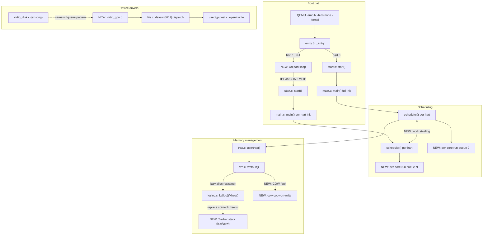
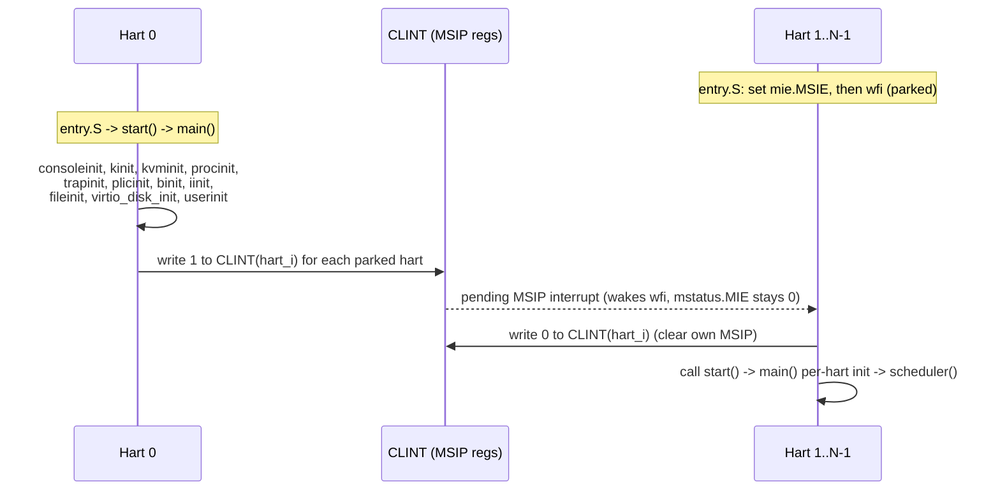
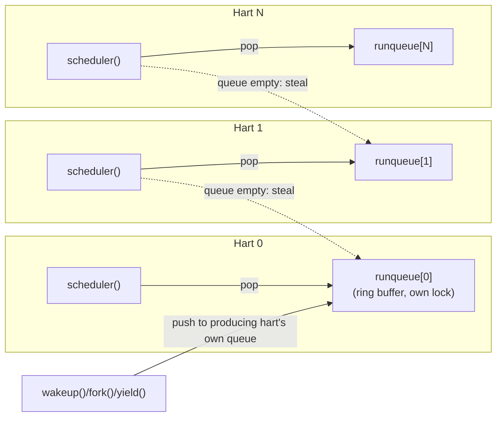
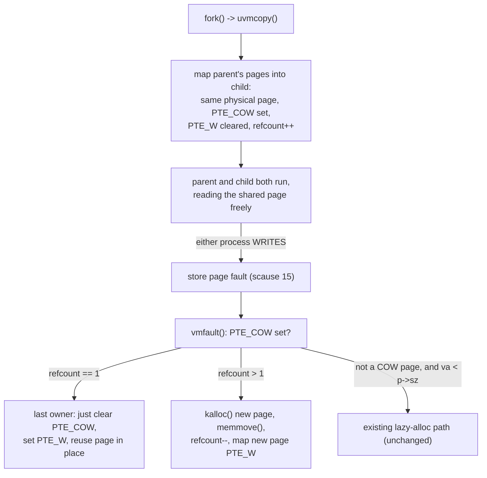
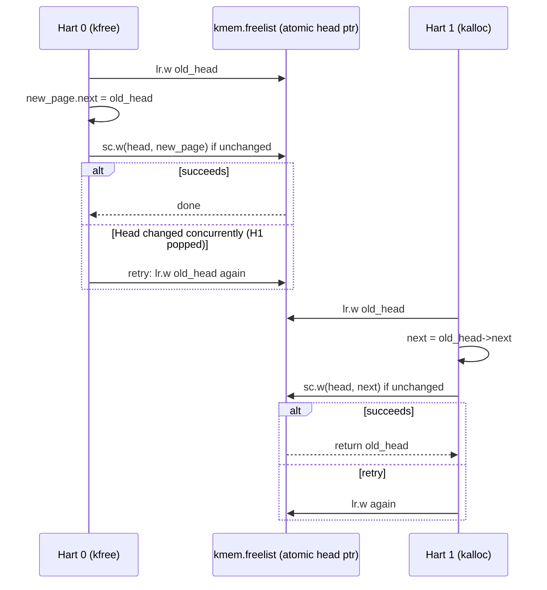

# xv6-riscv Future Work: Design Document

Baseline: this repo's current `kernel/` (RISC-V port, Sv39 paging, Sstc-based timer
interrupts, single global `proc[NPROC]` table, spinlock-protected `kmem` freelist,
`virtio_disk.c` as the only virtio-mmio driver). Every section below states the
current baseline behavior first, then the proposed change, so the diff in
responsibility is explicit.

Five features, in build order (each is independent, but this is the order that
minimizes rework — scheduler changes are easiest to validate once multi-hart
bring-up is under your own control instead of QEMU's):

1. Real hart lifecycle management (parking + IPI wake)
2. Per-core run queues with work stealing
3. Page-fault handler: lazy allocation + copy-on-write fork
4. Lock-free (Treiber stack) physical page allocator
5. virtio-gpu driver (2D framebuffer)

---

## 0. System-Level HLD — where each feature sits



---

## 1. Real Hart Lifecycle Management

### Current behavior
`Makefile` passes `-smp 3 -bios none` to QEMU. With no firmware layer, QEMU starts
**all** harts simultaneously at the reset vector (`0x80000000`). Every hart runs
`entry.S` → `start.c:start()` → `main.c:main()` concurrently from the first
instruction; `main.c:13-42`'s `if (cpuid()==0) {...} else { spin on `started` }`
is a *software* rendezvous, not a hardware-level "park," because QEMU never
put the other harts to sleep in the first place — they're all racing to that
check from t=0.

### Target behavior
Only hart 0 is allowed to run at all past `entry.S`; harts 1..N-1 physically
park (`wfi`) before touching any shared kernel state, and are explicitly woken
by hart 0 via a CLINT-generated inter-processor interrupt (IPI) once hart 0 has
finished the parts of `main()` that must run exactly once.

### HLD



### LLD

**Why WFI wakes without a full trap:** per the RISC-V spec, `wfi` retires once
a *locally enabled* (`mie` bit set) interrupt becomes pending, independent of
the *global* enable (`mstatus.MIE`). So a hart can sit with `mstatus.MIE = 0`
(no risk of a machine-mode trap actually firing) and still have `wfi` return
the instant hart 0 sets its MSIP bit. This is exactly the mechanism OpenSBI
uses for HSM hart-start, reimplemented here without an SBI layer.

**File-by-file changes:**

`kernel/entry.S` — replace the unconditional `call start` with a branch on
`mhartid`:

```asm
_entry:
        la sp, stack0
        li a0, 1024*4
        csrr a1, mhartid
        addi a1, a1, 1
        mul a0, a0, a1
        add sp, sp, a0

        csrr t0, mhartid
        bnez t0, park           # non-zero hartid -> park

        call start              # hart 0 boots immediately
        j spin

park:
        li t1, 8                # MIE bit (bit 3) = 1<<3, but use MSIE = 1<<3 in mie CSR
        csrs mie, t1            # enable machine software interrupt locally
1:
        wfi
        csrr t2, mip
        andi t2, t2, 8          # MSIP-caused mip bit
        beqz t2, 1b             # spurious wake (e.g. other pending irq bit) -> re-park

        # clear our own pending MSIP so it doesn't re-fire later
        csrr t0, mhartid
        li t3, 0x02000000       # CLINT_BASE
        slli t0, t0, 2          # hart * 4
        add t3, t3, t0
        sw zero, 0(t3)

        call start
spin:
        j spin
```

(`li t1, 8` — MSIE is bit 3 of `mie`; matches `mip`'s MSIP bit used in the wake
check.)

`kernel/start.c` — add a helper used only by hart 0, called at the very end of
the `cpuid()==0` branch in `main.c` instead of directly after `main.c:33`'s
`started` store:

```c
// start.c
void
wake_hart(int hart)
{
  *(volatile uint32 *)CLINT(hart) = 1;   // set MSIP for that hart
}
```

`kernel/main.c` — extend the existing `cpuid()==0` branch:

```c
if (cpuid() == 0) {
  consoleinit();
  ...
  userinit();

  __atomic_store_n(&started, 1, __ATOMIC_RELEASE);

  for (int i = 1; i < NCPU_ACTUAL; i++)   // NCPU_ACTUAL = value passed to -smp
    wake_hart(i);
} else {
  while (__atomic_load_n(&started, __ATOMIC_ACQUIRE) == 0)
    ;
  ...
}
```

Note the existing `started` spin-wait in the `else` branch can stay as a
defense-in-depth check (it's cheap), but it's no longer load-bearing for
correctness once harts are genuinely parked until woken — it protects against
a hypothetical spurious `wfi` return racing ahead of hart 0's init.

**Edge cases:**
- Spurious `wfi` wake (any other pending `mip` bit, e.g. a stray timer bit
  before `timerinit()` has run) — handled by the `mip` bit re-check loop in
  `entry.S` above.
- `CPUS` in the Makefile must match a compile-time or boot-time known hart
  count so hart 0 knows how many `wake_hart()` calls to issue — reuse `NCPU`
  from `param.h` as the upper bound, but only wake up to the actual `-smp`
  count (read from `mhartid` reachability, or just hardcode to match `CPUS`).

**Testing:** boot with `CPUS=1`, `CPUS=3`, `CPUS=8` (max `NCPU`) and confirm
via `printk("hart %d starting\n", cpuid())` (already in `main.c:38`) that
secondary harts only print *after* hart 0's init log lines — today they can
interleave because all harts race from t=0.

---

## 2. Per-Core Run Queues with Work Stealing

### Current behavior
`proc.c:429-470` (`scheduler()`): every hart independently scans the **entire**
shared `proc[NPROC]` array (`NPROC = 64`, `param.h:1`) each round, taking and
releasing each `p->lock` in turn. There is no per-core queue and no concept of
"which core last ran this process" — cache locality is incidental, and with
`NCPU = 8` harts all scanning 64 slots, contention on `p->lock` under load is
the bottleneck (each hart touches every proc's lock every round even when it
finds nothing runnable).

### Target behavior
Each hart owns a private run queue of `RUNNABLE` proc pointers. A hart normally
only touches its own queue. When a hart's queue is empty, it "steals" one
process from another hart's queue instead of scanning the global table.

### HLD



### LLD

**Data structures** (new, in `proc.h` alongside `struct cpu`):

```c
#define RQSIZE NPROC   // worst case every proc queued on one core

struct runqueue {
  struct spinlock lock;
  struct proc *procs[RQSIZE];
  int head, tail, count;   // ring buffer
};

// one per hart, parallel to the existing `cpus[NCPU]` array
extern struct runqueue runqueues[NCPU];
```

**Enqueue/dequeue primitives** (new file `kernel/runqueue.c`):

```c
void rq_push(int cpuid, struct proc *p);      // called with p->lock held
struct proc *rq_pop(int cpuid);               // returns 0 if empty
struct proc *rq_steal(int victim_cpuid);      // pop from tail (steal oldest,
                                               // leave hot/recent work for owner)
```

Push from the *tail*, owner pops from the *head* (FIFO for the owning core —
preserves round-robin fairness locally), thief steals from the *head* of the
victim's queue too, but only if `count > 1` (never steal a victim's only
runnable process, to avoid ping-ponging a single process between cores).

**Where processes get enqueued** — every place that currently sets
`p->state = RUNNABLE` needs a matching `rq_push`:
- `proc.c:228` (`wakeup()`/`sleep()` path)
- `proc.c:301` (`fork()`, in `allocproc`/`userinit`-adjacent code)
- `proc.c:591`, `proc.c:612` (whatever paths those are — grep confirmed 5 call
  sites total in this checkout; each needs the matching `rq_push` right after
  the existing `p->state = RUNNABLE` line, still under `p->lock`)

Pick *which* hart's queue to push onto: simplest correct policy is "push onto
the queue of the hart that ran this process last" (cached in a new
`int last_cpu` field on `struct proc`), falling back to the pushing hart's own
queue for a brand-new process (`fork`/`userinit`). This gives you basic CPU
affinity for free.

**Rewritten `scheduler()`:**

```c
void
scheduler(void)
{
  struct cpu *c = mycpu();
  int id = cpuid();
  c->proc = 0;

  for (;;) {
    intr_on();
    intr_off();

    struct proc *p = rq_pop(id);
    if (p == 0) {
      // try to steal from a neighbor before going idle
      for (int i = 1; i < NCPU && p == 0; i++)
        p = rq_steal((id + i) % NCPU);
    }

    if (p) {
      acquire(&p->lock);
      if (p->state == RUNNABLE) {   // re-check: may have changed between
                                     // pop/steal and acquiring p->lock
        p->state = RUNNING;
        p->last_cpu = id;
        c->proc = p;
        swtch(&c->context, &p->context);
        mycpu()->intena = 0;
        c->proc = 0;
      } else {
        // raced with something else (e.g. killed) — drop it
      }
      release(&p->lock);
    } else {
      asm volatile("wfi");
    }
  }
}
```

**Concurrency notes:**
- `runqueue.lock` is separate from `p->lock` — always acquire `runqueue.lock`
  *before* `p->lock` when pushing (push happens while caller already holds
  `p->lock`, so the order is actually `p->lock` → `runqueue.lock` for push,
  and `runqueue.lock` alone, then `p->lock` on pop — this is intentionally
  asymmetric and safe because the two paths never nest the other way).
- The re-check `if (p->state == RUNNABLE)` after `acquire(&p->lock)` in
  `scheduler()` is required: a process can be popped/stolen and then get
  killed or re-queued by another hart between the lock-free pop and the
  `p->lock` acquire.
- Stealing must never leave a victim's queue corrupted under concurrent pop —
  `rq_steal` and `rq_pop` both take `runqueues[victim].lock`, so they
  serialize naturally against each other.

**Testing:** a synthetic workload that forks N tight-loop children pinned by
construction to appear on one hart's queue (e.g. all forked from a process
last run on hart 0), then verify (via a debug counter incremented in
`rq_steal`) that idle harts actually steal work rather than sitting in `wfi`
while hart 0's queue backs up.

---

## 3. Page-Fault Handler: Lazy Allocation + Copy-on-Write Fork

### Current behavior
This checkout already has a *partial* page-fault path:
- `trap.c:71-74` routes `scause == 13 || scause == 15` (load/store page fault)
  into `vm.c:459` `vmfault(pagetable, p->sz, r_stval(), read)`.
- `vm.c:459-478` `vmfault()` currently handles exactly one case: a fault on an
  address that is within `p->sz` (i.e., already claimed by `sbrk()`) but not
  yet backed by a physical page — it `kalloc()`s a zeroed page and maps it.
  This is **lazy allocation for `sbrk`-grown memory**, already working.
- `vm.c:299-326` `uvmcopy()` (used by `fork()`) is **fully eager**: it walks
  every mapped page in the parent and immediately `kalloc()`s + `memmove()`s a
  private copy for the child, for every page, even ones neither process will
  ever write to.

### Target behavior
Extend `vmfault()` to also handle **copy-on-write** faults, and change
`uvmcopy()` to map pages **shared and read-only** between parent and child
instead of copying eagerly. The actual copy happens lazily, inside
`vmfault()`, the first time either process tries to *write* to a shared page.

### HLD



### LLD

**New PTE bit** — `riscv.h:395-399` defines `PTE_V/R/W/X/U` using bits 0-4;
`PTE_FLAGS(pte)` masks bits 0-9 (`0x3FF`), and bits 8-9 are the RISC-V "reserved
for software" (RSW) bits, currently unused. Add:

```c
// riscv.h
#define PTE_COW (1L << 8)   // software-only bit: page is copy-on-write
```

**Physical-page reference counting** — required because a COW page can be
shared by more than 2 processes (grandchildren). Add a parallel array in
`kalloc.c`, indexed by physical page number:

```c
// kalloc.c
struct spinlock refcnt_lock;
uint8 pageref[(PHYSTOP - KERNBASE) / PGSIZE];

#define PA2IDX(pa) (((uint64)(pa) - KERNBASE) / PGSIZE)

void incref(void *pa) {
  acquire(&refcnt_lock);
  pageref[PA2IDX(pa)]++;
  release(&refcnt_lock);
}

int decref(void *pa) {   // returns resulting count
  acquire(&refcnt_lock);
  int c = --pageref[PA2IDX(pa)];
  release(&refcnt_lock);
  return c;
}
```

`kfree()` must check `decref(pa) > 0` and, if so, return *without* actually
freeing the page or filling it with junk — the page is still live for other
owners. `kalloc()` must set the new page's refcount to 1 before returning it.

**Rewritten `uvmcopy()`** (`vm.c:299`) — replace the eager `kalloc`+`memmove`
with a shared read-only mapping:

```c
int
uvmcopy(pagetable_t old, pagetable_t new, uint64 sz)
{
  pte_t *pte;
  uint64 pa, i;
  uint flags;

  for (i = 0; i < sz; i += PGSIZE) {
    if ((pte = walk(old, i, 0)) == 0) continue;
    if ((*pte & PTE_V) == 0) continue;
    pa = PTE2PA(*pte);

    if (*pte & PTE_W) {
      *pte = (*pte & ~PTE_W) | PTE_COW;   // parent's own mapping also
                                          // becomes COW from this point on
    }
    flags = PTE_FLAGS(*pte);

    if (mappages(new, i, PGSIZE, pa, flags) != 0)
      goto err;
    incref((void *)pa);
  }
  return 0;
err:
  uvmunmap(new, 0, i / PGSIZE, 0);   // do_free=0: don't free shared pages here
  return -1;
}
```

**Extended `vmfault()`** (`vm.c:459`) — add the COW branch ahead of the
existing lazy-alloc logic:

```c
uint64
vmfault(pagetable_t pagetable, uint64 psz, uint64 va, int read)
{
  va = PGROUNDDOWN(va);
  pte_t *pte = walk(pagetable, va, 0);

  if (pte && (*pte & PTE_V) && (*pte & PTE_COW)) {
    uint64 pa = PTE2PA(*pte);
    uint flags = (PTE_FLAGS(*pte) & ~PTE_COW) | PTE_W;

    if (pageref_count((void *)pa) == 1) {
      // sole remaining owner: no copy needed
      *pte = PA2PTE(pa) | flags;
      return pa;
    }
    char *mem = kalloc();
    if (mem == 0) return 0;
    memmove(mem, (char *)pa, PGSIZE);
    decref((void *)pa);
    *pte = PA2PTE((uint64)mem) | flags;
    return (uint64)mem;
  }

  // existing lazy-allocation path, unchanged:
  if (va >= psz) return 0;
  if (ismapped(pagetable, va)) return 0;
  uint64 mem = (uint64)kalloc();
  if (mem == 0) return 0;
  memset((void *)mem, 0, PGSIZE);
  if (mappages(pagetable, va, PGSIZE, mem, PTE_W | PTE_U | PTE_R) != 0) {
    kfree((void *)mem);
    return 0;
  }
  return mem;
}
```

(`pageref_count()` — read-only variant of the refcount lookup; `PA2PTE` — this
checkout's macro for building a leaf PTE from a physical address, matching
`PTE2PA`'s inverse in `riscv.h`.)

**`copyout()` also needs the COW check** (`vm.c:345`) — a kernel-initiated
write into user memory (e.g. `read()` filling a user buffer) must trigger the
same copy if it targets a COW page, since it bypasses the hardware store-fault
path entirely (the kernel writes via the *kernel's* mapping of the physical
page, not through the user PTE, so no trap occurs). Add an explicit
`vmfault(pagetable, psz, dstva, 1)` call at the top of `copyout()` before the
`memmove`, discarding a `PTE_W`-but-not-COW result (already-writable pages
return early, unaffected).

**Edge cases:**
- Fork failure mid-`uvmcopy()`: `uvmunmap(..., do_free=0)` — must NOT free the
  shared physical pages the child partially mapped, only tear down the
  child's page-table entries (parent and any other refs are still alive).
- `exit()`/`freeproc()`'s existing `uvmfree()` path must route through
  `kfree()` (which now consults `decref`) rather than an unconditional free —
  check every caller of `kfree()` in `vm.c` for a bypass.
- Fork bomb / refcount overflow: `pageref[]` is `uint8` (max 255 sharers) —
  fine given `NPROC = 64`, but note the limit explicitly.

**Testing:** classic COW test — `fork()`, have parent and child each write to
a distinct byte in a shared large buffer, verify each sees only its own write
(no cross-contamination) and that total physical pages in use *drops* relative
to eager-copy baseline for a large, mostly-unwritten address space.

---

## 4. Lock-Free (Treiber Stack) Physical Page Allocator

### Current behavior
`kalloc.c:20-23`: a single global `struct { spinlock lock; struct run *freelist; }`.
Every `kalloc()`/`kfree()`, from any hart, serializes on `kmem.lock`
(`kalloc.c:44,52,71,77`). Under concurrent allocation from multiple harts
(exactly the scenario multi-hart bring-up + per-core scheduling above make
more likely), this lock is a straight-line bottleneck: only one hart can be
inside `kalloc()`/`kfree()` at a time, system-wide.

### Target behavior
Replace the locked freelist with a **lock-free Treiber stack**: push and pop
on the freelist head using `lr.w`/`sc.w` (RISC-V's load-reserved /
store-conditional pair, the ISA's compare-and-swap primitive) instead of a
spinlock.

### HLD



### LLD

**Why LR/SC and not a generic atomic CAS builtin:** RISC-V has no native `cas`
instruction; `lr.w`/`sc.w` is the primitive pair the ISA provides, and it's
exactly what GCC/Clang lower `__sync_bool_compare_and_swap` to on RV64 anyway
— implementing it "by hand" here is what makes this a genuine RISC-V-specific
piece of work rather than just calling a builtin.

**Data structure change** (`kalloc.c`):

```c
struct run {
  struct run *next;
};

// replaces: struct { struct spinlock lock; struct run *freelist; } kmem;
struct run *volatile freelist_head;   // no lock
```

**Push (`kfree`)** — inline asm, retry loop on SC failure:

```c
void
kfree(void *pa)
{
  if (((uint64)pa % PGSIZE) != 0 || (char *)pa < end || (uint64)pa >= PHYSTOP)
    panic("kfree");

  memset(pa, 1, PGSIZE);
  struct run *r = (struct run *)pa;
  struct run *old_head;

  do {
    old_head = freelist_head;      // plain load is fine here: lr.d below
                                    // re-validates against concurrent change
    r->next = old_head;
    asm volatile(
      "1: lr.d t0, (%1)\n"          // t0 = current head
      "   bne  t0, %2, 2f\n"        // if current head != old_head, retry
      "   sc.d t1, %3, (%1)\n"      // *head = new (r); t1 = 0 on success
      "   bnez t1, 1b\n"            // sc failed -> retry
      "   j 3f\n"
      "2: \n"                       // stale old_head -> caller loop retries
      "3: \n"
      : "=&r"(old_head)
      : "r"(&freelist_head), "r"(old_head), "r"(r)
      : "t0", "t1", "memory"
    );
  } while (freelist_head != r);     // simplified retry condition, see note
}
```

(The inline-asm sketch above is illustrative; the clean, correct version uses
a single `lr.d`/`sc.d` retry loop entirely in asm — or, more pragmatically,
implemented via GCC's `__atomic_compare_exchange_n(&freelist_head, &old_head,
r, ...)` builtin, which the RISC-V backend compiles directly to an `lr.d`/
`sc.d` loop. **Recommendation: use the builtin**, and reserve hand-written
`lr.w`/`sc.w` asm for the resume-worthy detail of explaining *why* it's
correct — writing it by hand is a good learning exercise but the builtin is
the safer implementation to actually ship.)

**Pop (`kalloc`)**, using the builtin form (cleaner, recommended):

```c
void *
kalloc(void)
{
  struct run *old_head, *new_head;

  do {
    old_head = freelist_head;
    if (old_head == 0)
      return 0;
    new_head = old_head->next;
  } while (!__atomic_compare_exchange_n(
              &freelist_head, &old_head, new_head,
              0, __ATOMIC_ACQUIRE, __ATOMIC_RELAXED));

  memset((char *)old_head, 5, PGSIZE);
  return (void *)old_head;
}
```

**The ABA problem, addressed explicitly (this is the detail worth having a
real answer for in an interview about this bullet):** a Treiber stack is
vulnerable to ABA when a popped node can be freed and *reallocated* with a
different `->next` before the original popper's CAS retries. Here, that would
require: hart A reads `old_head = X`, gets preempted; hart B pops X, pops X's
old next Y, then *pushes X back* (with a new `->next`, e.g. Z instead of Y);
hart A's CAS then succeeds (head is X again) but installs the stale `Y` as
the new head — silently corrupting the freelist with a since-repushed-elsewhere
node graph. **Mitigation used here:** because `kfree()`'s caller always writes
`r->next = old_head` fresh, immediately before its own CAS attempt, and pages
are never independently mutated by third parties while off the freelist, the
specific ABA reordering above can't construct an inconsistent `->next` chain
in *this* allocator (unlike a general-purpose lock-free stack of
externally-mutable nodes). State this reasoning explicitly if asked — "we
don't get to skip thinking about ABA, we analyzed it and it's benign here
because X" is a stronger claim than "lock-free stacks don't have ABA."

**Testing:** a stress test — spawn one kernel thread/proc per hart doing tight
`kalloc()`/`kfree()` loops on the *same* small pool of pages, run for a fixed
duration, then verify (a) no panic, (b) the freelist's total node count is
unchanged before/after (nothing lost or duplicated) by walking it single-
threaded with all harts parked. Compare `kalloc`/`kfree` throughput against
the current spinlock version under this same test to quantify the win.

---

## 5. virtio-gpu Driver (2D Framebuffer)

### Current behavior
`kernel/virtio_disk.c` is the only virtio-mmio driver: it targets
`VIRTIO0 = 0x10001000` (`memlayout.h`), sets up one descriptor table
(`struct virtq_desc[NUM]`, `virtio.h`), one avail ring, one used ring, and
waits for completion via `sleep_prepare()`/`sleep()`, woken by
`virtio_disk_intr()` which `trap.c:200` dispatches to on `VIRTIO0_IRQ` via
PLIC. Devices are exposed to user space through the `devsw[]` table
(`file.h:33-40`) — `CONSOLE = 1` is the only registered major device, wired to
`consolewrite`/`consoleread` in `console.c:200-202`.

### Target behavior
A second virtio-mmio device (`virtio-gpu`, device ID 16 per the virtio spec),
driven with the same virtqueue mechanics as the disk driver, exposing a 2D
framebuffer to user space as `/gpu0` — `open()` + `write()`, no new syscalls.

### HLD

```mermaid
sequenceDiagram
    participant U as user/gputest.c
    participant K as kernel: gpuwrite()
    participant Q as virtqueue (shared with QEMU)
    participant D as QEMU virtio-gpu device
    participant P as PLIC

    U->>K: write(fd, framebuffer, WIDTH*HEIGHT*4)
    K->>K: one-time: RESOURCE_CREATE_2D (if not already created)
    K->>Q: ATTACH_BACKING (describe framebuffer pages)
    K->>Q: TRANSFER_TO_HOST_2D (copy pixel data to host resource)
    K->>Q: RESOURCE_FLUSH (present to display)
    K->>K: sleep_prepare(&gpu.free[0]); sleep()
    Q->>D: device processes queued descriptors
    D->>P: interrupt: command chain complete
    P->>K: devintr() -> gpu_intr() -> wakeup()
    K-->>U: write() returns
```

### LLD

**Device registration** (`file.h`):

```c
#define CONSOLE 1
#define GPU     2     // new major device number, NDEV=10 in param.h has room
```

**MMIO base address** (`memlayout.h`) — QEMU places additional virtio-mmio
devices at consecutive `0x1000`-sized slots; add:

```c
#define VIRTIO1     0x10002000   // second virtio-mmio slot: gpu
#define VIRTIO1_IRQ 2            // matches QEMU's virt-machine IRQ wiring
```

(Actual IRQ number depends on how many virtio-mmio slots QEMU's `virt` machine
exposes and which one the `-device virtio-gpu-device` command-line flag binds
to — verify against `qemu -machine virt -device help` output / QEMU source
rather than assuming; the disk uses slot 0 / IRQ 1 as an existing fact from
`memlayout.h`, so gpu should not collide with that.)

**Command structs** — virtio-gpu's command set is CSS-style: 3 fixed-size
control-queue commands cover the whole 2D path. New file `kernel/virtio_gpu.h`:

```c
#define VIRTIO_GPU_CMD_RESOURCE_CREATE_2D   0x0101
#define VIRTIO_GPU_CMD_RESOURCE_ATTACH_BACKING 0x0106
#define VIRTIO_GPU_CMD_TRANSFER_TO_HOST_2D  0x0105
#define VIRTIO_GPU_CMD_RESOURCE_FLUSH       0x0104
#define VIRTIO_GPU_CMD_SET_SCANOUT          0x0103

struct virtio_gpu_ctrl_hdr {
  uint32 type;
  uint32 flags;
  uint64 fence_id;
  uint32 ctx_id;
  uint32 padding;
};

struct virtio_gpu_resource_create_2d {
  struct virtio_gpu_ctrl_hdr hdr;
  uint32 resource_id;
  uint32 format;     // VIRTIO_GPU_FORMAT_B8G8R8A8_UNORM = 1
  uint32 width, height;
};

struct virtio_gpu_transfer_to_host_2d {
  struct virtio_gpu_ctrl_hdr hdr;
  struct { uint32 x, y, width, height; } r;
  uint64 offset;
  uint32 resource_id;
  uint32 padding;
};

struct virtio_gpu_resource_flush {
  struct virtio_gpu_ctrl_hdr hdr;
  struct { uint32 x, y, width, height; } r;
  uint32 resource_id;
  uint32 padding;
};
```

(This mirrors the real virtio-gpu spec's control-queue command layout — get
exact field order/sizes from the spec before wiring this up for real; a
mismatch here is a silent-corruption bug, not a compile error, since it's raw
bytes over DMA.)

**Driver state** (`kernel/virtio_gpu.c`), following `virtio_disk.c`'s existing
shape (one descriptor table + avail/used ring, one in-flight-request tracking
array, one sleeplock-free `sleep()`/`wakeup()` completion pattern):

```c
static struct gpu {
  char pages[2 * PGSIZE];
  struct virtq_desc *desc;
  struct virtq_avail *avail;
  struct virtq_used *used;
  char free[NUM];
  uint16 used_idx;
  struct { char status; } info[NUM];
  struct spinlock vgpu_lock;
  int resource_created;
  uint32 fb_resource_id;
} gpu;

void gpuinit(void);          // mirrors virtio_disk_init()
void gpuwrite_cmd(void *cmd, int len);  // shared helper: fill descriptor,
                                        // notify device, sleep for completion
void gpu_intr(void);          // called from devintr() on VIRTIO1_IRQ
```

**`gpuwrite()`** — the `devsw[GPU].write` entry point, called from
`filewrite()` (`file.c:135`) exactly the way `consolewrite()` already is:

```c
int
gpuwrite(int user_src, uint64 src, int n)
{
  acquire(&gpu.vgpu_lock);

  if (!gpu.resource_created) {
    struct virtio_gpu_resource_create_2d cmd = {
      .hdr.type = VIRTIO_GPU_CMD_RESOURCE_CREATE_2D,
      .resource_id = 1, .format = 1 /*B8G8R8A8*/,
      .width = WIDTH, .height = HEIGHT,
    };
    gpuwrite_cmd(&cmd, sizeof(cmd));      // blocks until device ack
    // ... ATTACH_BACKING with the kernel-side pixel buffer's physical pages ...
    gpu.resource_created = 1;
  }

  // copy n bytes from user space into the kernel-side pixel buffer
  copyin(myproc()->pagetable, myproc()->sz, (char *)fb_kernel_buf, src, n);

  struct virtio_gpu_transfer_to_host_2d xfer = {
    .hdr.type = VIRTIO_GPU_CMD_TRANSFER_TO_HOST_2D,
    .r = {0, 0, WIDTH, HEIGHT}, .resource_id = 1,
  };
  gpuwrite_cmd(&xfer, sizeof(xfer));

  struct virtio_gpu_resource_flush flush = {
    .hdr.type = VIRTIO_GPU_CMD_RESOURCE_FLUSH,
    .r = {0, 0, WIDTH, HEIGHT}, .resource_id = 1,
  };
  gpuwrite_cmd(&flush, sizeof(flush));

  release(&gpu.vgpu_lock);
  return n;
}
```

**Wiring into the kernel** (mirrors `console.c:200-202` exactly):

```c
// gpuinit(), called from main.c alongside virtio_disk_init()
devsw[GPU].write = gpuwrite;
devsw[GPU].read  = 0;   // write-only device for v1
```

**`devintr()` extension** (`trap.c:188-220`) — add a branch parallel to the
existing `VIRTIO0_IRQ` one:

```c
} else if (irq == VIRTIO1_IRQ) {
  gpu_intr();
}
```

**Device-node creation** — same mechanism as `/console` (created once via
`mknod`), add during `mkfs` or first-boot init: `mknod("/gpu0", GPU, 0)`.

**Scope explicitly excluded (call this out on the resume too, not just here):**
no 3D/virgl command stream, no multiple scanouts, no cursor plane, no
resource formats besides one fixed 32bpp format, no `SET_SCANOUT` beyond a
single fixed display — this is deliberately the smallest slice of the spec
that gets pixels from a user-space buffer onto QEMU's display window.

**Testing:** the `user/gputest.c` program from earlier in this conversation
(open `/gpu0`, fill a buffer with a solid color, `write()`), run under
`make qemu` with `-device virtio-gpu-device` added to `QEMUOPTS`, verify the
QEMU display window shows the solid color; then a second test writing a
pattern (e.g. a gradient or a checkerboard) to catch row/stride or format
mistakes that a solid fill would hide.

---

## Cross-Cutting Notes

- **Build order matters for testing, not for correctness** — features 3, 4,
  and 5 don't depend on 1 or 2 at the code level, but validating 2 (work
  stealing) is much easier once 1 (real hart control) makes hart timing
  deterministic instead of QEMU-race-dependent.
- **Everything here is scoped to be individually finishable** — each section
  above is a few hundred lines of kernel code, matching the granularity the
  resume bullets implied. None of these require touching the boot ROM,
  QEMU's device models, or anything outside `kernel/`.
- **Riskiest item:** the hand-written `lr.w`/`sc.w` asm in section 4 — get it
  reviewed or replace it with the `__atomic_compare_exchange_n` builtin form
  before relying on it; a subtly wrong retry loop there fails intermittently
  under load, which is the worst kind of bug to debug in a kernel allocator.
